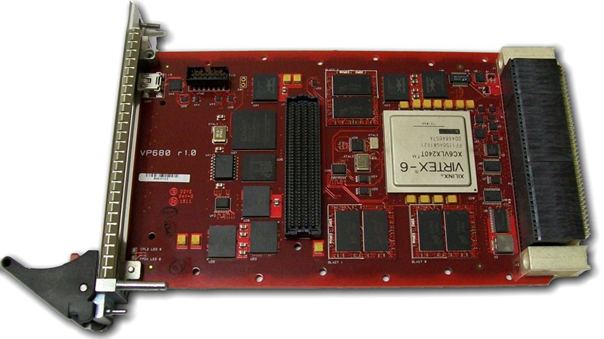
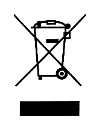

# User Manual

VP680 Virtex™-6 3U VPX FPGA Card

THE VP680 IS DESIGNED TO MEET THE EUROPEAN UNION \(EU\) RESTRICTIONS OF HAZARDOUS SUBSTANCE \(ROHS\) DIRECTIVE \(2015/863\) CURRENT REVISION.

Publication No. UM004 Rev. 1.7

Document History

<table>
  <thead>
    <tr>
      <th style="text-align:left">Revision</th>
      <th style="text-align:left">Date</th>
      <th style="text-align:left">Changes</th>
      <th style="text-align:left">Author</th>
      <th style="text-align:left">Peer Review</th>
      <th style="text-align:left">Quality Approval</th>
    </tr>
  </thead>
  <tbody>
    <tr>
      <td style="text-align:left">r0.1</td>
      <td style="text-align:left">03/23/2011</td>
      <td style="text-align:left">Draft</td>
      <td style="text-align:left">N/A</td>
      <td style="text-align:left">N/A</td>
      <td style="text-align:left">N/A</td>
    </tr>
    <tr>
      <td style="text-align:left">r0.2</td>
      <td style="text-align:left">05/11/2011</td>
      <td style="text-align:left">Added FPGA pin out tables. Textual changes. Internally reviewed.</td>
      <td
      style="text-align:left">N/A</td>
        <td style="text-align:left">N/A</td>
        <td style="text-align:left">N/A</td>
    </tr>
    <tr>
      <td style="text-align:left">r0.3</td>
      <td style="text-align:left">05/12/2011</td>
      <td style="text-align:left">
        
Added direction information on peripheral pins. Added FLASH and configuration
          info.

        
Added BLAST VIO matrix.

      </td>
      <td style="text-align:left">N/A</td>
      <td style="text-align:left">N/A</td>
      <td style="text-align:left">N/A</td>
    </tr>
    <tr>
      <td style="text-align:left">r1.0</td>
      <td style="text-align:left">05/12/2011</td>
      <td style="text-align:left">Release</td>
      <td style="text-align:left">N/A</td>
      <td style="text-align:left">N/A</td>
      <td style="text-align:left">N/A</td>
    </tr>
    <tr>
      <td style="text-align:left">r1.1</td>
      <td style="text-align:left">05/13/2011</td>
      <td style="text-align:left">
        
Added product photo.

        
Update errata appendix.

      </td>
      <td style="text-align:left">N/A</td>
      <td style="text-align:left">N/A</td>
      <td style="text-align:left">N/A</td>
    </tr>
    <tr>
      <td style="text-align:left">r1.2</td>
      <td style="text-align:left">08/01/2011</td>
      <td style="text-align:left">Correction of commercial temperature range.</td>
      <td style="text-align:left">N/A</td>
      <td style="text-align:left">N/A</td>
      <td style="text-align:left">N/A</td>
    </tr>
    <tr>
      <td style="text-align:left">r1.3</td>
      <td style="text-align:left">09/09/2011</td>
      <td style="text-align:left">
        
Added OpenVPX profile specification.

        
Added weight specification.

      </td>
      <td style="text-align:left">N/A</td>
      <td style="text-align:left">N/A</td>
      <td style="text-align:left">N/A</td>
    </tr>
    <tr>
      <td style="text-align:left">r1.4</td>
      <td style="text-align:left">08/21/2014</td>
      <td style="text-align:left">
        
Added description to section 3.1.2 about a mechanical exception made to
          the VITA 48.2 standard with regards to the clamshell.

        
Added conduction-cooled clamshell drawing.

      </td>
      <td style="text-align:left">N/A</td>
      <td style="text-align:left">N/A</td>
      <td style="text-align:left">N/A</td>
    </tr>
    <tr>
      <td style="text-align:left">r1.5</td>
      <td style="text-align:left">06/22/2015</td>
      <td style="text-align:left">Added detail to power supply section, replaced references to Virtex5 with
        Virtex6</td>
      <td style="text-align:left">N/A</td>
      <td style="text-align:left">N/A</td>
      <td style="text-align:left">N/A</td>
    </tr>
    <tr>
      <td style="text-align:left">r1.6</td>
      <td style="text-align:left">06/23/2016</td>
      <td style="text-align:left">
        
Added front panel options to section 3.1.1.

        
Added VITA 48.1 compliance to section 3.1.1.

      </td>
      <td style="text-align:left">RZA</td>
      <td style="text-align:left">N/A</td>
      <td style="text-align:left">N/A</td>
    </tr>
    <tr>
      <td style="text-align:left">r1.7</td>
      <td style="text-align:left">05/29/2019</td>
      <td style="text-align:left">
        
Updated Abaco Formatting

        
Added Certificate of Volatility (CoV) for VP680 with BLAST V: document
          CV006 in <a href>Appendix C, &#x201C;Statement of Volatility (VP680 BLAST V)&#x201D;</a>.

        
Added Certificate of Volatility (CoV) for VP680 with BLAST H: document
          CV008 in <a href>Appendix D, &#x201C;Statement of Volatility (VP680 BLASH H)&#x201D;</a>.

      </td>
      <td style="text-align:left">LH</td>
      <td style="text-align:left">Pko</td>
      <td style="text-align:left">Pko</td>
    </tr>
  </tbody>
</table>Waste Electrical and Electronic Equipment \(WEEE\) Returns

<table>
  <thead>
    <tr>
      <th style="text-align:left">
        
      </th>
      <th style="text-align:left">
        
Abaco Systems is registered with an approved Producer Compliance Scheme
          (PCS) and, subject to suitable contractual arrangements being in place,
          will ensure WEEE is processed in accordance with the requirements of the
          WEEE Directive.

        
Abaco Systems will evaluate requests to take back products purchased by
          our customers before August 13, 2005 on a case by case basis. A WEEE management
          fee may apply.

      </th>
    </tr>
  </thead>
  <tbody></tbody>
</table>About This Manual

Conventions

Notices

This manual may use the following types of notice:

 warning

Warnings alert you to the risk of severe personal injury.

 caution

Cautions alert you to system danger or loss of data.

 Note

Notes call attention to important features or instructions.

 tip

Tips give guidance on procedures that may be tackled in a number of ways.

 link

Links take you to other documents or websites.

Numbers

All numbers are expressed in decimal, except addresses and memory or register data, which are expressed in hexadecimal. Where confusion may occur, decimal numbers have a “D” subscript and binary numbers have a “b” subscript. The prefix “0x” shows a hexadecimal number, following the ‘C’ programming language convention. Thus:

 One dozen = 12D = 0x0C = 1100b

The multipliers “k”, “M” and “G” have their conventional scientific and engineering meanings of x103, x106 and x109, respectively, and can be used to define a transfer rate. The only exception to this is in the description of the size of memory areas, when “K”, “M” and “G” mean x210, x220 and x230 respectively.

In PowerPC terminology, multiple bit fields are numbered from 0 to n where 0 is the MSB and n is the LSB. PCI terminology follows the more familiar convention that bit 0 is the LSB and n is the MSB.

Text

Signal names ending with a tilde \(“\#”\) denote active low signals; all other signals are active high. “-” and “+” denote the low and high components of a differential signal respectively.

Further Information

Abaco Website

You can find information regarding Abaco products on the following website:

 link

[https://www.abaco.com/products](https://www.abaco.com/products)

Abaco Documents

This document is distributed via the Abaco website. You may register for access to manuals via the website.

 link

[https://www.abaco.com/products/vp680-fpga-card](https://www.abaco.com/products/vp680-fpga-card)

Third-party Documents

VITA 46.0-2007 Rev1.2, April 2008

VITA 48.2-2010 Rev1.0, July 2010

VITA 57.1-2010 Rev1.1, February 2010

VITA 65-2010 Rev1.0, June 2010

 link

[https://www.vita.com/](https://www.vita.com/)

IEEE 1101.2-1992 IEEE Standard for Mechanical Core Specifications for Conduction-Cooled Eurocard

 link

[https://www.ieee.com/](https://www.ieee.com/)

 Note

Technical literature describing components used on the VP680 is available from the manufacturers’ websites.

Safety

This module presents no hazard to the user.

EMC

This module is designed to operate from within an enclosed host system, which is built to provide EMC shielding. Operation within the EU EMC guidelines is not guaranteed unless it is installed within an adequate host system. This module is protected from damage by fast voltage transients originating from outside the host system which may be introduced through the system.

Technical Support Contact Information

You can find technical assistance contact details on the website Support page.

 link

[https://www.abaco.support](https://www.abaco.com/support)

Abaco will log your query in the Technical Support database and allocate it a unique Case number for use in any future correspondence.

Alternatively, you may also contact Abaco’s Technical Support via:

 link

[support@abaco.com](mailto:support@abaco.com)

Returns

If you need to return a product, there is a Return Materials Authorization \(RMA\) form available via the website Support page.

 link

[https://www.abaco.com/support](https://www.abaco.com/support)

Do not return products without first contacting the Abaco Repairs facility.

Contents

[About This Manual 3]()

[1 • General Description 11]()

[1.1 OpenVPX 12]()

[2 • Hardware Specifications 13]()

[2.1 Physical Specifications 13]()

[2.1.1 Air-cooled 13]()

[2.1.2 Conduction-cooled 13]()

[2.1.3 Backplane Keying 14]()

[2.1.4 Front Panel Layout 14]()

[2.2 VPX P0 Connector 16]()

[2.2.1 Power Supply 16]()

[2.2.2 Utility Plane 17]()

[2.2.3 System Reset \(SYSRESET\#\) 17]()

[2.2.4 Bussed GPIO \(GDiscrete1\) 17]()

[2.2.5 Battery Supply \(P1-VBAT\) 18]()

[2.3 VPX P1 Connector 18]()

[2.4 VPX P2 Connector 20]()

[2.5 Virtex-6 FPGA Device 22]()

[2.6 Front Panel I/O 22]()

[2.6.1 UART Over USB 22]()

[2.6.2 Status LEDs \(CPLD\) 23]()

[2.6.3 Debug LEDs \(FPGA\) 23]()

[2.7 FPGA Mezzanine Card \(FMC\) 24]()

[2.7.1 Bank A \(LA, HA\) Connections 25]()

[2.7.2 Bank B \(HB\) Connections 28]()

[2.7.3 Gigabit Transceiver Connections 30]()

[2.7.4 Miscellaneous FMC Connections 31]()

[2.7.5 I/O Standard Support 31]()

[2.7.6 VADJ Programming 32]()

[2.8 BLAST Sites 32]()

[2.9 Clock Tree 33]()

[2.9.1 AUX\_CLK± Reference Clock 34]()

[2.9.2 REF\_CLK± Reference Clock 34]()

[2.9.3 Onboard MGT Reference Clock 35]()

[2.9.4 FMC MGT Reference Clock 35]()

[2.9.5 FMC Clock Connections 36]()

[2.9.6 Miscellaneous Clock Connections 36]()

[2.10 Local I2C Bus 37]()

[2.10.1 Clock Synthesizer \(CDCE925\) 37]()

[2.10.2 Onboard Voltage and Temperature Monitoring \(ADT7411\) 38]()

[2.11 Serial FLASH 39]()

[2.12 FPGA Configuration 40]()

[2.12.1 JTAG Chain 40]()

[2.12.2 FLASH Storage 41]()

[2.12.3 Configuration Controller \(CPLD\) 41]()

[2.12.4 User Image Programming 42]()

[2.12.5 Safety Configuration Jumper 43]()

[3 • Environment Specifications 44]()

[3.1 Temperature 44]()

[3.2 Convection-cooling 44]()

[3.3 Conduction-cooling 44]()

[A • FPGA Bank Mapping 45]()

[B • Errata 47]()

[B.1 PCB Revision 1.0 47]()

[C • Statement of Volatility \(VP680 BLAST V\) 48]()

[C.1 Volatile Memory \(VP680, BLAST V\) 48]()

[C.2 Non-Volatile Memory \(VP680, BLAST V\) 48]()

[D • Statement of Volatility \(VP680 BLAST H\) 49]()

[D.1 Volatile Memory \(VP680, BLAST H\) 49]()

[D.2 Non-Volatile Memory \(VP680, BLAST H\) 49]()

[Glossary 50]()

List of Figures

[Figure 1‑1 VP680 Block Diagram 11]()

[Figure 2‑1 Conduction-cooled Clamshell Dimensions \(mm\) 14]()

[Figure 2‑2 Air-cooled Front \(left\) and Conduction-cooled Front \(right\) 15]()

[Figure 2‑3 Clock Architecture 33]()

[Figure 2‑4 Configuration Architecture 40]()

[Figure 2‑5 FLASH Arrangement 41]()

[Figure 2‑6 Connector / Jumper Locations 43]()

List of Tables

[Table 2-1 VPX P0 Connector Pin Assignments 16]()

[Table 2-2 Utility Plane Connections 17]()

[Table 2-3 VPX P1 Connector Pin Assignments 18]()

[Table 2-4 VPX P1 Connections 18]()

[Table 2-5 VPX P2 Connector Pin Assignments 20]()

[Table 2-6 VPX P2 Connections 20]()

[Table 2-7 UART Connections 22]()

[Table 2-8 CPLD LED Board Status 23]()

[Table 2-9 LED Connections 23]()

[Table 2-10 FMC LA Connections 25]()

[Table 2-11 FMC HA Connections 27]()

[Table 2-12 FMC HB Connections 28]()

[Table 2-13 FMC GTX/GTH Connections 30]()

[Table 2-14 Miscellaneous FMC Connections 31]()

[Table 2-15 Supported VADJ Voltage Options 32]()

[Table 2-16 BLAST Configuration Options 32]()

[Table 2-17 BLAST Memory/Processing Options 32]()

[Table 2-18 AUX\_CLK Connections 34]()

[Table 2-19 REF\_CLK Connections 34]()

[Table 2-20 Clock Path Selection 35]()

[Table 2-21 Onboard MGT Reference Clock Connections 35]()

[Table 2-22 FMC MGT Reference Clock Connections 35]()

[Table 2-23 FMC Clock Connections 36]()

[Table 2-24 Miscellaneous Clock Connections 36]()

[Table 2-25 Local I2C Bus Connections 37]()

[Table 2-26 Monitoring Device \#1 Connections 38]()

[Table 2-27 Monitoring Device \#2 Connections 38]()

[Table 2-28 SPI FLASH Connections 39]()

[Table 2-29 CPLD Connections 42]()

[Table A-1 FPGA Bank Mapping 45]()

[Table A-2 BLAST VIO Matrix 46]()

[Table C-1 Volatile Memory \(VP680, BLAST V\) 48]()

[Table C-2 Non-Volatile Memory \(VP680, BLAST V\) 48]()

[Table D-1 Volatile Memory \(VP680, BLAST H\) 49]()

[Table D-2 Non-Volatile Memory \(VP680, BLAST H\) 49]()

## General Description

The VP680 is a high performance ANSI/VITA 46.0 VPX standard compliant card with advanced digital signal processing capabilities. The design has been targeted for customer programmable implementations of complex FPGA algorithms for Digital Signal Processing \(DSP\) applications. The VP680 product is in the 3U VPX form factor, offering various direct onboard interface options that are closely coupled to large - fast onboard memory resources of the Xilinx Virtex™-6 FPGA. The VP680 is an excellent choice for high performance applications that require the use of accelerated frequency-domain algorithms such as with FFTs. Abaco Systems offers many off-the-shelf Intellectual Property \(IP\) cores for applications that require the highest level of performance.

Figure 1‑1 VP680 Block Diagram

1 UART over USB is not available on conduction-cooled VP680.

2 Refer to [Appendix B, “Errata”]().

OpenVPX

The VP680 is configurable due to the FPGA and can therefore support quite a few profiles. The reference design support x4 PCIe Gen1 and therefore matches with the following profiles:

MOD3-PAY-1D-16.2.6-1 \(only using lane 0-1\)

MOD3-PAY-2F-16.2.7-1 \(only using DP01\)

MOD3-PAY-1F4U-16.2.8-1 \(only using DP01\)

Other profiles may be supported but requires a modification in the FPGA firmware.

## Hardware Specifications

Physical Specifications

The VP680 is a 3U \(100x160mm\) module that can be ordered as air-cooled module or conduction cooled module.

Air-cooled

The air-cooled VP680 complies with the physical dimensions given in ANSI/VITA 46.0 and VITA 48.1 with the exception that the typical PCB thickness is 2.1mm instead of 1.6mm. Normally this should not be an issue for board sliders in an air-cooled system enclosure, but in special cases Abaco Systems can provide a PCB thickness of 1.6mm. Please contact Abaco Systems.

The weight of an air cooled VP680, including front panel and BLASTs, excluding FMC is 192 grams.

Conduction-cooled

The conduction cooled VP680 is a 1.0” pitch module that complies with ANSI/VITA 48.2 with the exception that the clamshell is 4.96mm longer than specified in the VITA 48.2 standard. The clamshell thermal solution is designed to accommodate an FMC bezel which requires extra length. If this is an issue, please contact Abaco Systems.

The clamshell allows system integrators to use their own FMC modules and FMC bezel designs. The clamshell provides additional VPX connector protection for 2-Level Maintenance requirements. Please contact Abaco Systems for full 2-Level Maintenance support.

 Figure 2‑1 Conduction-cooled Clamshell Dimensions \(mm\)

Backplane Keying

Both alignment keys 1 and 2 are placed by default with the un-keyed version  
\(1-1469492-9\). Contact Abaco Systems if specific keying is required.

Front Panel Layout

There are two air-cooled front options; with and without FMC bezel cut-out. The front side of the conduction-cooled module has an FMC bezel cut-out as well as some small holes for LED viewing. The following front panel options are available:

Air-cooled

0.8‑inch \(IEEE 1101.10 and VITA 46 compliant\)

1.0‑inch \(IEEE 1101.10 – VITA 46\)

1.0‑inch – VITA 48.1 \(as per VITA 65\)

Conduction-cooled

1.0‑inch – VITA 48.2 \(as per VITA 65\) \(Only for conduction-cooled option\)

Figure 2‑2 Air-cooled Front \(left\) and Conduction-cooled Front \(right\)

 

VPX P0 Connector

P0 connector is loaded with three power wafers, three single-ended wafers, and two differential wafers. The following table shows the OpenVPX definition for the P0 connector contacts.

Table 2-1 VPX P0 Connector Pin Assignments

| Pin | Row G | Row F | Row E | Row D | Row C | Row B | Row A |
| :--- | :--- | :--- | :--- | :--- | :--- | :--- | :--- |
| 1 | Vs1 | Vs1 | Vs1 | No Pad | Vs2 | Vs2 | Vs2 |
| 2 | Vs1 | Vs1 | Vs1 | No Pad | Vs2 | Vs2 | Vs2 |
| 3 | Vs3 | Vs3 | Vs3 | No Pad | Vs3 | Vs3 | Vs3 |
| 4 | SM2 | SM3 | GND | -12V\_AUX | GND | SYSRESET\# | NVMRO |
| 5 | GAP\# | GA4\# | GND | 3.3V\_AUX | GND | SM0 | SM1 |
| 6 | GA3\# | GA2\# | GND | +12V\_AUX | GND | GA1\# | GA0\# |
| 7 | TCK | GND | TDO | TDI | GND | TMS | TRST\# |
| 8 | GND | REF\_CLK- | REF\_CLK+ | GND | AUX\_CLK- | AUX\_CLK+ | GND |

Power Supply

Power is supplied to the VP680 on VPX P0 connector trough three power supply voltages; Vs1, Vs2, and Vs3. The voltage levels are respectively 12V, 3.3V, and 5V. Several onboard DC-DC converters generate the appropriate voltage rails for the different devices and interfaces present onboard. The maximum power drawn from the backplane is as follows:

Vs1 \(12V\) : Max. 12 Watt

Vs2 \(3.3V\) : Max. 30 Watt

Vs3 \(5V\) : Max. 30 Watt

These numbers include the maximum power that can be consumed by an AV57.1 compliant FMC.

The auxiliary power supplies -12V\_AUX and +12V\_AUX are not connected. The auxiliary power supply 3.3V\_AUX is only used to pull up signals Gdiscrete1 and MaskableReset\#.

Utility Plane

The table below shows the utility plane connections to the FPGA. The connections to AUX\_CLK± and REF\_CLK± reference clocks are described in [Section 2.9.1]() and [Section 2.9.2](). Signals SM2 and SM3 are not connected.

Table 2-2 Utility Plane Connections

| FPGA Pin | Net Name | FPGA Bank | DIR | P0, P1 |  |  |
| :--- | :--- | :--- | :--- | :--- | :--- | :--- |
| Connector | Pin Number | Pin Name |  |  |  |  |
| AG12 | GA0\# | 33 | I | P0 | A6 | GA0\# |
| AL13 | GA1\# | 33 | I | P0 | B6 | GA1\# |
| AK13 | GA2\# | 33 | I | P0 | F6 | GA2\# |
| AH14 | GA3\# | 33 | I | P0 | G6 | GA3\# |
| AH13 | GA4\# | 33 | I | P0 | F5 | GA4\# |
| AN14 | GAP\# | 33 | I | P0 | G5 | GAP\# |
| AP14 | NVMRO | 33 | I | P0 | A4 | NVMRO |
| L29 | I2C\_SCL\_VPX | 15 | I/O | P0 | B5 | SM0 |
| R27 | I2C\_SDA\_VPX | 15 | I/O | P0 | A5 | SM1 |
| AC12 | SYSRESET\_I\# | 33 | I | P0 | B4 | SYSRESET\# |
| J24 | SYSRESET\_O\# | 24 | O |  |  |  |
| H23 | GDISCRETE1\_I | 24 | I | P1 | G1 | GDiscrete1 |
| M22 | GDISCRETE1\_O | 24 | O |  |  |  |
| AE22 | MASKABLERESET\# | 24 | I | P1 | G15 | MaskableReset\# |
| G23 | SYS\_CON\# | 24 | I | P1 | G5 | SYS\_CON\# |

The I/O standard to be assigned depends on BLAST configuration. Refer to  
Table A-2 BLAST VIO Matrix in [Appendix A](). The VP680 implements level translation.

System Reset \(SYSRESET\#\)

The system reset signal is implemented as input to the FPGA \(SYSRESET\_I\#\) and as output from the FPGA and CPLD \(SYSRESET\_O\#\). The VP680 will actively drive SYSRESET\# low until FPGA configuration is finished, after which SYSRESET\# is released \(Hi-Z\).

Bussed GPIO \(GDiscrete1\)

The general purpose I/O signal is implemented as input \(GDISCRETE1\_I\) and as output \(GDISCRETE1\_O\). When GDISCRETE1\_O is driven low, the VP680 will actively drive GDiscrete1 low. When GDISCRETE1\_O is driven high, GDiscrete1 is placed in a high impedance state.

Battery Supply \(P1-VBAT\)

The VBATT connection on the FPGA is used for data stream encryption and needs a continuous power source. The battery supply from the VPX backplane is used to provide FPGA VBATT. A maximum of 15µA is drawn from the VPX backplane.

VPX P1 Connector

The P1 connector has all positions loaded with differential wafers. A total of 32 differential pairs are available configured as 16 transceiver pairs. The VP680 connects all of those signals to MGT blocks on the FPGA. Possible applications are for instance two times 8 lanes PCI Express or other high-speed differential protocols like Aurora or sFPDP. The single-ended signals are part of the utility plane described in [Section 2.2.2]().

Table 2-3 VPX P1 Connector Pin Assignments

| Pin | Row G | Row F | Row E | Row D | Row C | Row B | Row A |
| :--- | :--- | :--- | :--- | :--- | :--- | :--- | :--- |
| 1 | Gdiscrete1 | GND | P1-TX0- | P1-TX0+ | GND | P1-RX0- | P1-RX0+ |
| 2 | GND | P1-TX1- | P1-TX1+ | GND | P1-RX1- | P1-RX1+ | GND |
| 3 | P1-VBAT | GND | P1-TX2- | P1-TX2+ | GND | P1-RX2- | P1-RX2+ |
| 4 | GND | P1-TX3- | P1-TX3+ | GND | P1-RX3- | P1-RX3+ | GND |
| 5 | SYS\_CON\# | GND | P1-TX4- | P1-TX4+ | GND | P1-RX4- | P1-RX4+ |
| 6 | GND | P1-TX5- | P1-TX5+ | GND | P1-RX5- | P1-RX5+ | GND |
| 7 | Reserved | GND | P1-TX6- | P1-TX6+ | GND | P1-RX6- | P1-RX6+ |
| 8 | GND | P1-TX7- | P1-TX7+ | GND | P1-RX7- | P1-RX7+ | GND |
| 9 | P1-SE0 | GND | P1-TX8- | P1-TX8+ | GND | P1-RX8- | P1-RX8+ |
| 10 | GND | P1-TX9- | P1-TX9+ | GND | P1-RX9- | P1-RX9+ | GND |
| 11 | P1-SE1 | GND | P1-TX10- | P1-TX10+ | GND | P1-RX10- | P1-RX10+ |
| 12 | GND | P1-TX11- | P1-TX11+ | GND | P1-RX11- | P1-RX11+ | GND |
| 13 | P1-SE2 | GND | P1-TX12- | P1-TX12+ | GND | P1-RX12- | P1-RX12+ |
| 14 | GND | P1-TX13- | P1-TX13+ | GND | P1-RX13- | P1-RX13+ | GND |
| 15 | Maskable reset\# | GND | P1-TX14- | P1-TX14+ | GND | P1-RX14- | P1-RX14+ |
| 16 | GND | P1-TX15- | P1-TX15+ | GND | P1-RX15- | P1-RX15+ | GND |

Table 2-4 VPX P1 Connections

| FPGA Pin | Net Name | GTX/GTH Block | P1 |  |
| :--- | :--- | :--- | :--- | :--- |
| Pin Number | Pin Name |  |  |  |
| N4 | P1\_RXn00 | 115 | B1 | P1\_RX0- |
| N3 | P1\_RXp00 | A1 | P1\_RX0+ |  |
| M2 | P1\_TXn00 | E1 | P1\_TX0- |  |
| M1 | P1\_TXp00 | D1 | P1\_TX0+ |  |
| L4 | P1\_RXn01 | 115 | C2 | P1\_RX1- |
| L3 | P1\_RXp01 | B2 | P1\_RX1+ |  |
| K2 | P1\_TXn01 | F2 | P1\_TX1- |  |
| K1 | P1\_TXp01 | E2 | P1\_TX1+ |  |
| K6 | P1\_RXn02 | 115 | B3 | P1\_RX2- |
| K5 | P1\_RXp02 | A3 | P1\_RX2+ |  |
| H2 | P1\_TXn02 | E3 | P1\_TX2- |  |
| H1 | P1\_TXp02 | D3 | P1\_TX2+ |  |
| J4 | P1\_RXn03 | 115 | C4 | P1\_RX3- |
| J3 | P1\_RXp03 | B4 | P1\_RX3+ |  |
| F2 | P1\_TXn03 | F4 | P1\_TX3- |  |
| F1 | P1\_TXp03 | E4 | P1\_TX3+ |  |
| AA4 | P1\_RXn04 | 114 | B5 | P1\_RX4- |
| AA3 | P1\_RXp04 | A5 | P1\_RX4+ |  |
| Y2 | P1\_TXn04 | E5 | P1\_TX4- |  |
| Y1 | P1\_TXp04 | D5 | P1\_TX4+ |  |
| W4 | P1\_RXn05 | 114 | C6 | P1\_RX5- |
| W3 | P1\_RXp05 | B6 | P1\_RX5+ |  |
| V2 | P1\_TXn05 | F6 | P1\_TX5- |  |
| V1 | P1\_TXp05 | E6 | P1\_TX5+ |  |
| U4 | P1\_RXn06 | 114 | B7 | P1\_RX6- |
| U3 | P1\_RXp06 | A7 | P1\_RX6+ |  |
| T2 | P1\_TXn06 | E7 | P1\_TX6- |  |
| T1 | P1\_TXp06 | D7 | P1\_TX6+ |  |
| R4 | P1\_RXn07 | 114 | C8 | P1\_RX7- |
| R3 | P1\_RXp07 | B8 | P1\_RX7+ |  |
| P2 | P1\_TXn07 | F8 | P1\_TX7- |  |
| P1 | P1\_TXp07 | E8 | P1\_TX7+ |  |
| AG4 | P1\_RXn08 | 113 | B9 | P1\_RX8- |
| AG3 | P1\_RXp08 | A9 | P1\_RX8+ |  |
| AH2 | P1\_TXn08 | E9 | P1\_TX8- |  |
| AH1 | P1\_TXp08 | D9 | P1\_TX8+ |  |
| AF6 | P1\_RXn09 | 113 | C10 | P1\_RX9- |
| AF5 | P1\_RXp09 | B10 | P1\_RX9+ |  |
| AF2 | P1\_TXn09 | F10 | P1\_TX9- |  |
| AF1 | P1\_TXp09 | E10 | P1\_TX9+ |  |
| AE4 | P1\_RXn10 | 113 | B11 | P1\_RX10- |
| AE3 | P1\_RXp10 | A11 | P1\_RX10+ |  |
| AD2 | P1\_TXn10 | E11 | P1\_TX10- |  |
| AD1 | P1\_TXp10 | D11 | P1\_TX10+ |  |
| AC4 | P1\_RXn11 | 113 | C12 | P1\_RX11- |
| AC3 | P1\_RXp11 | B12 | P1\_RX11+ |  |
| AB2 | P1\_TXn11 | F12 | P1\_TX11- |  |
| AB1 | P1\_TXp11 | E12 | P1\_TX11+ |  |
| AP6 | P1\_RXn12 | 112 | B13 | P1\_RX12- |
| AP5 | P1\_RXp12 | A13 | P1\_RX12+ |  |
| AP2 | P1\_TXn12 | E13 | P1\_TX12- |  |
| AP1 | P1\_TXp12 | D13 | P1\_TX12+ |  |
| AM6 | P1\_RXn13 | 112 | C14 | P1\_RX13- |
| AM5 | P1\_RXp13 | B14 | P1\_RX13+ |  |
| AN4 | P1\_TXn13 | F14 | P1\_TX13- |  |
| AN3 | P1\_TXp13 | E14 | P1\_TX13+ |  |
| AL4 | P1\_RXn14 | 112 | B15 | P1\_RX14- |
| AL3 | P1\_RXp14 | A15 | P1\_RX14+ |  |
| AM2 | P1\_TXn14 | E15 | P1\_TX14- |  |
| AM1 | P1\_TXp14 | D15 | P1\_TX14+ |  |
| AJ4 | P1\_RXn15 | 112 | C16 | P1\_RX15- |
| AJ3 | P1\_RXp15 | B16 | P1\_RX15+ |  |
| AK2 | P1\_TXn15 | F16 | P1\_TX15- |  |
| AK1 | P1\_TXp15 | E16 | P1\_TX15+ |  |

VPX P2 Connector

P2 connector has all positions loaded with differential wafers. A total of 32 differential pairs are available. The VP680 connects 24 differential pairs to LVDS capable I/O on the FPGA. The FPGA can use each differential pair as either input or output. The remaining differential pairs and the single-ended signals are not connected.

Table 2-5 VPX P2 Connector Pin Assignments

| Pin | Row G | Row F | Row E | Row D | Row C | Row B | Row A |
| :--- | :--- | :--- | :--- | :--- | :--- | :--- | :--- |
| 1 | N/C | GND | P2-DP1- | P2-DP1+ | GND | P2-DP0- | P2-DP0+ |
| 2 | GND | P2-DP3- | P2-DP3+ | GND | P2-DP2- | P2-DP2+ | GND |
| 3 | N/C | GND | P2-DP5- | P2-DP5+ | GND | P2-DP4- | P2-DP4+ |
| 4 | GND | P2-DP7- | P2-DP7+ | GND | P2-DP6- | P2-DP6+ | GND |
| 5 | N/C | GND | P2-DP9- | P2-DP9+ | GND | P2-DP8- | P2-DP8+ |
| 6 | GND | P2-DP11- | P2-DP11+ | GND | P2-DP10- | P2-DP10+ | GND |
| 7 | N/C | GND | P2-DP13- | P2-DP13+ | GND | P2-DP12- | P2-DP12+ |
| 8 | GND | P2-DP15- | P2-DP15+ | GND | P2-DP14- | P2-DP14+ | GND |
| 9 | N/C | GND | P2-DP17- | P2-DP17+ | GND | P2-DP16- | P2-DP16+ |
| 10 | GND | P2-DP19- | P2-DP19+ | GND | P2-DP18- | P2-DP18+ | GND |
| 11 | N/C | GND | P2-DP21- | P2-DP21+ | GND | P2-DP20- | P2-DP20+ |
| 12 | GND | P2-DP23- | P2-DP23+ | GND | P2-DP22- | P2-DP22+ | GND |
| 13 | N/C | GND | N/C | N/C | GND | N/C | N/C |
| 14 | GND | N/C | N/C | GND | N/C | N/C | GND |
| 15 | N/C | GND | N/C | N/C | GND | N/C | N/C |
| 16 | GND | N/C | N/C | GND | N/C | N/C | GND |

Table 2-6 VPX P2 Connections

| FPGA Pin | Net Name | P2 |  |
| :--- | :--- | :--- | :--- |
| Pin Number | Pin Name |  |  |
| AP9 | P2\_DPn00 | B1 | P2\_DP0- |
| AN9 | P2\_DPp00 | A1 | P2\_DP0+ |
| AL9 | P2\_DPn01 | E1 | P2\_DP1- |
| AK9 | P2\_DPp01 | D1 | P2\_DP1+ |
| AL8 | P2\_DPn02 | C2 | P2\_DP2- |
| AK8 | P2\_DPp02 | B2 | P2\_DP2+ |
| AJ9 | P2\_DPn03 | F2 | P2\_DP3- |
| AH9 | P2\_DPp03 | E2 | P2\_DP3+ |
| AH8 | P2\_DPn04 | B3 | P2\_DP4- |
| AG8 | P2\_DPp04 | A3 | P2\_DP4+ |
| AF10 | P2\_DPn05 | E3 | P2\_DP5- |
| AF9 | P2\_DPp05 | D3 | P2\_DP5+ |
| AE9 | P2\_DPn06 | C4 | P2\_DP6- |
| AD9 | P2\_DPp06 | B4 | P2\_DP6+ |
| AC9 | P2\_DPn07 | F4 | P2\_DP7- |
| AD10 | P2\_DPp07 | E4 | P2\_DP7+ |
| AB10 | P2\_DPn08 | B5 | P2\_DP8- |
| AC10 | P2\_DPp08 | A5 | P2\_DP8+ |
| AC24 | P2\_DPn09 | E5 | P2\_DP9- |
| AC23 | P2\_DPp09 | D5 | P2\_DP9+ |
| AB23 | P2\_DPn10 | C6 | P2\_DP10- |
| AA23 | P2\_DPp10 | B6 | P2\_DP10+ |
| AA24 | P2\_DPn11 | F6 | P2\_DP11- |
| Y24 | P2\_DPp11 | E6 | P2\_DP11+ |
| V23 | P2\_DPn12 | B7 | P2\_DP12- |
| U23 | P2\_DPp12 | A7 | P2\_DP12+ |
| T23 | P2\_DPn13 | E7 | P2\_DP13- |
| T24 | P2\_DPp13 | D7 | P2\_DP13+ |
| N24 | P2\_DPn14 | C8 | P2\_DP14- |
| N23 | P2\_DPp14 | B8 | P2\_DP14+ |
| L24 | P2\_DPn15 | F8 | P2\_DP15- |
| M23 | P2\_DPp15 | E8 | P2\_DP15+ |
| M10 | P2\_DPn16 | B9 | P2\_DP16- |
| L10 | P2\_DPp16 | A9 | P2\_DP16+ |
| K9 | P2\_DPn17 | E9 | P2\_DP17- |
| L9 | P2\_DPp17 | D9 | P2\_DP17+ |
| F10 | P2\_DPn18 | C10 | P2\_DP18- |
| F9 | P2\_DPp18 | B10 | P2\_DP18+ |
| E9 | P2\_DPn19 | F10 | P2\_DP19- |
| E8 | P2\_DPp19 | E10 | P2\_DP19+ |
| D9 | P2\_DPn20 | B11 | P2\_DP20- |
| C9 | P2\_DPp20 | A11 | P2\_DP20+ |
| D10 | P2\_DPn21 | E11 | P2\_DP21- |
| C10 | P2\_DPp21 | D11 | P2\_DP21+ |
| C8 | P2\_DPn22 | C12 | P2\_DP22- |
| B8 | P2\_DPp22 | B12 | P2\_DP22+ |
| A8 | P2\_DPn23 | F12 | P2\_DP23- |
| A9 | P2\_DPp23 | E12 | P2\_DP23+ |

Virtex-6 FPGA Device

The Virtex-6 FPGA device is the DSP processing node of the VP680. Any Virtex-6 FPGA device from the Virtex-6 SXT and LXT family in an 1156 balls fine line ball grid array package can be ordered:

XC6VLX130T

XC6VLX195T

XC6VLX240T

XC6VLX365T

XC6VSX315T

XC6VSX475T

Front Panel I/O

The VP680 reserves the front panel I/O area for the FMC site. On the air-cooled VP680 there is a UART over USB option for debugging purposes. In addition there are some status and debug LEDs available.

UART Over USB

One UART connection is optionally available on the front panel via a mini-USB connector. Its location is depicted in Figure 2‑6. The serial interface is made using a USB to UART Bridge \(CP2102\). The UART side connects to the FPGA.

Table 2-7 UART Connections

| FPGA Pin | Net Name | FPGA Bank | DIR | CP2102 |  |
| :--- | :--- | :--- | :--- | :--- | :--- |
| Pin Number | Pin Name |  |  |  |  |
| D11 | UART\_TXD | 35 | O | 25 | RXD |
| H15 | UART\_RXD | 36 | I | 26 | TXD |

The I/O standard to be assigned depends on BLAST configuration. Refer to  
Table A-2 BLAST VIO Matrix in [Appendix A](). The VP680 implements level translation.

Status LEDs \(CPLD\)

Four LEDs are connected to the CPLD for board status purposes. There is a pre-defined function for these LEDs. One LED \(CPLD LED 0\) is located on the component side of the VP680. The other LEDs are located on the solder side of the VP680 \(see Figure 2‑2\).

Table 2-8 CPLD LED Board Status

<table>
  <thead>
    <tr>
      <th style="text-align:left"></th>
      <th style="text-align:left"><b>OFF</b>
      </th>
      <th style="text-align:left"><b>ON</b>
      </th>
      <th style="text-align:left"><b>FLASHING</b>
      </th>
    </tr>
  </thead>
  <tbody>
    <tr>
      <td style="text-align:left">
        
<b>LED 0</b>
        

        
<b>(red)</b>
        

      </td>
      <td style="text-align:left">Power OK</td>
      <td style="text-align:left">Power not OK (ex. VADJ)</td>
      <td style="text-align:left">VADJ not OK</td>
    </tr>
    <tr>
      <td style="text-align:left">
        
<b>LED 1</b>
        

        
<b>(red)</b>
        

      </td>
      <td style="text-align:left">FPGA configured</td>
      <td style="text-align:left">FPGA not configured</td>
      <td style="text-align:left">Loading to FLASH</td>
    </tr>
    <tr>
      <td style="text-align:left">
        
<b>LED 2</b>
        

        
<b>(red)</b>
        

      </td>
      <td style="text-align:left">FLASH idle</td>
      <td style="text-align:left">FLASH busy</td>
      <td style="text-align:left">Safety configuration loaded into FPGA, or attempted to load.</td>
    </tr>
    <tr>
      <td style="text-align:left">
        
<b>LED 3</b>
        

        
<b>(red)</b>
        

      </td>
      <td style="text-align:left">FPGA expects 100 MHz on VPX REF_CLK&#xB1;.</td>
      <td style="text-align:left">FPGA expects 25 MHz on VPX REF_CLK&#xB1;.</td>
      <td style="text-align:left">CRC error during FPGA configuration.</td>
    </tr>
  </tbody>
</table>Debug LEDs \(FPGA\)

Four red LEDs are connected to the FPGA for debugging purposes. There is no pre-defined function for these LEDs. One LED \(FPGA\_LED0\) is located on the component side of the VP680. The other LEDs are located on the solder side of the VP680 \(see Figure 2‑2\).

To turn on an LED, drive the signal low. To turn an LED off, make the signal Hi-Z.

Table 2-9 LED Connections

| FPGA Pin | Net Name | FPGA Bank | DIR |
| :--- | :--- | :--- | :--- |
| F31 | FPGA\_LED0 | 16 | O |
| G32 | FPGA\_LED1 | 16 | O |
| L26 | FPGA\_LED2 | 16 | O |
| L25 | FPGA\_LED3 | 16 | O |

The I/O standard to be assigned depends on BLAST configuration. Refer to  
Table A-2 BLAST VIO Matrix in [Appendix A](). The VP680 implements level translation.

FPGA Mezzanine Card \(FMC\)

The FPGA interfaces to an FPGA Mezzanine Card \(FMC\) via a high pin count \(HPC\) VITA 57.1 site. All banks \(LA, HA, HB\) are connected to the FPGA. The FMC site provides flexibility for adding analog and/or digital I/O via customer developed, third party or Abaco Systems FMC boards. Abaco Systems offers a wide variety of FMC cards that can be used on the VP680. Among others:

FMC103: 4-ch A/D 210 Msps @ 12-bits

FMC104: 4-ch A/D 250 Msps @ 14-bits

FMC107: 8-ch A/D 65 Msps @ 12-bits

* FMC108: 8-ch A/D 250 Msps @ 14-bits

FMC204: 4-ch DA 1 Gsps @ 16-bits

FMC150: Dual A/D. Dual D/A Channel

* * 2-ch A/D 250 Msps @ 14-bits
  * 2-ch D/A 800 Msps @ 16-bits

FMC110: Dual A/D. Dual D/A Channel

* * 2-ch A/D 1 Gsps @ 12-bits
  * 2-ch D/A 1 Gsps @ 16-bits

FMC122: Single-Dual Channel A/D

* * 1-ch A/D 2.50 Gsps @ 8-bits, or
  * 2-ch A/D 1.25 Gsps @ 8-bits

FMC125: Quad-Dual-Single Channel A/D

* * 1-ch A/D 5.00 Gsps @ 8-bits, or
  * 2-ch A/D 2.50 Gsps @ 8-bits, or
  * 4-ch A/D 1.25 Gsps @ 8-bits

FMC126: Quad-Dual-Single Channel A/D

* * 1-ch A/D 5.00 Gsps @ 10-bits, or
  * 2-ch A/D 2.50 Gsps @ 10-bits, or
  * 4-ch A/D 1.25 Gsps @ 10-bits

Bank A \(LA, HA\) Connections

Differential routing is applied with matched delay on all pairs within bank A \(LA, HA\).

Table 2-10 FMC LA Connections

| FPGA Pin | Net Name | FMC HPC |  |
| :--- | :--- | :--- | :--- |
| Pin Number | Pin Name |  |  |
| AF33 | LA\_N00\_CC | G7 | LA00-\_CC |
| AE33 | LA\_P00\_CC | G6 | LA00+\_CC |
| AC30 | LA\_N01\_CC | D9 | LA01-\_CC |
| AD30 | LA\_P01\_CC | D8 | LA01+\_CC |
| AC29 | LA\_N02 | H8 | LA02- |
| AD29 | LA\_P02 | H7 | LA02+ |
| AF34 | LA\_N03 | G10 | LA03- |
| AE34 | LA\_P03 | G9 | LA03+ |
| AC28 | LA\_N04 | H11 | LA04- |
| AB28 | LA\_P04 | H10 | LA04+ |
| AE32 | LA\_N05 | D12 | LA05- |
| AD32 | LA\_P05 | D11 | LA05+ |
| AC27 | LA\_N06 | C11 | LA06- |
| AB27 | LA\_P06 | C10 | LA06+ |
| AG32 | LA\_N07 | H14 | LA07- |
| AG33 | LA\_P07 | H13 | LA07+ |
| AB26 | LA\_N08 | G13 | LA08- |
| AA26 | LA\_P08 | G12 | LA08+ |
| AF31 | LA\_N09 | D15 | LA09- |
| AG31 | LA\_P09 | D14 | LA09+ |
| AC25 | LA\_N10 | C15 | LA10- |
| AB25 | LA\_P10 | C14 | LA10+ |
| AB33 | LA\_N11 | H17 | LA11- |
| AC33 | LA\_P11 | H16 | LA11+ |
| AD31 | LA\_N12 | G16 | LA12- |
| AE31 | LA\_P12 | G15 | LA12+ |
| Y26 | LA\_N13 | D18 | LA13- |
| AA25 | LA\_P13 | D17 | LA13+ |
| V29 | LA\_N14 | C19 | LA14- |
| U28 | LA\_P14 | C18 | LA14+ |
| U30 | LA\_N15 | H20 | LA15- |
| U31 | LA\_P15 | H19 | LA15+ |
| T25 | LA\_N16 | G19 | LA16- |
| U25 | LA\_P16 | G18 | LA16+ |
| W34 | LA\_N17\_CC | D21 | LA17-\_CC |
| V34 | LA\_P17\_CC | D20 | LA17+\_CC |
| W30 | LA\_N18\_CC | C23 | LA18-\_CC |
| V30 | LA\_P18\_CC | C22 | LA18+\_CC |
| V27 | LA\_N19 | H23 | LA19- |
| V28 | LA\_P19 | H22 | LA19+ |
| V33 | LA\_N20 | G22 | LA20- |
| V32 | LA\_P20 | G21 | LA20+ |
| Y31 | LA\_N21 | H26 | LA21- |
| Y32 | LA\_P21 | H25 | LA21+ |
| Y34 | LA\_N22 | G25 | LA22- |
| Y33 | LA\_P22 | G24 | LA22+ |
| Y29 | LA\_N23 | D24 | LA23- |
| W29 | LA\_P23 | D23 | LA23+ |
| W32 | LA\_N24 | H29 | LA24- |
| W31 | LA\_P24 | H28 | LA24+ |
| Y27 | LA\_N25 | G28 | LA25- |
| Y28 | LA\_P25 | G27 | LA25+ |
| V25 | LA\_N26 | D27 | LA26- |
| W25 | LA\_P26 | D26 | LA26+ |
| W26 | LA\_N27 | C27 | LA27- |
| W27 | LA\_P27 | C26 | LA27+ |
| T29 | LA\_N28 | H32 | LA28- |
| T28 | LA\_P28 | H31 | LA28+ |
| R34 | LA\_N29 | G31 | LA29- |
| R33 | LA\_P29 | G30 | LA29+ |
| T31 | LA\_N30 | H35 | LA30- |
| T30 | LA\_P30 | H34 | LA30+ |
| T34 | LA\_N31 | G34 | LA31- |
| T33 | LA\_P31 | G33 | LA31+ |
| U27 | LA\_N32 | H38 | LA32- |
| U26 | LA\_P32 | H37 | LA32+ |
| U32 | LA\_N33 | G37 | LA33- |
| U33 | LA\_P33 | G36 | LA33+ |

Table 2-11 FMC HA Connections

| FPGA Pin | Net Name | FMC HPC |  |
| :--- | :--- | :--- | :--- |
| Pin Number | Pin Name |  |  |
| AG30 | HA\_N00\_CC | F5 | HA00-\_CC |
| AF30 | HA\_P00\_CC | F4 | HA00+\_CC |
| AE26 | HA\_N01\_CC | E3 | HA01-\_CC |
| AF26 | HA\_P01\_CC | E2 | HA01+\_CC |
| AD26 | HA\_N02 | K8 | HA02- |
| AD25 | HA\_P02 | K7 | HA02+ |
| AJ32 | HA\_N03 | J7 | HA03- |
| AJ31 | HA\_P03 | J6 | HA03+ |
| AJ30 | HA\_N04 | F8 | HA04- |
| AJ29 | HA\_P04 | F7 | HA04+ |
| AK32 | HA\_N05 | E7 | HA05- |
| AK33 | HA\_P05 | E6 | HA05+ |
| AK31 | HA\_N06 | K11 | HA06- |
| AL31 | HA\_P06 | K10 | HA06+ |
| AL33 | HA\_N07 | J10 | HA07- |
| AM33 | HA\_P07 | J9 | HA07+ |
| AM32 | HA\_N08 | F11 | HA08- |
| AN32 | HA\_P08 | F10 | HA08+ |
| AP33 | HA\_N09 | E10 | HA09- |
| AP32 | HA\_P09 | E9 | HA09+ |
| AM31 | HA\_N10 | K14 | HA10- |
| AL30 | HA\_P10 | K13 | HA10+ |
| AD27 | HA\_N11 | J13 | HA11- |
| AE27 | HA\_P11 | J12 | HA11+ |
| AH32 | HA\_N12 | F14 | HA12- |
| AH33 | HA\_P12 | F13 | HA12+ |
| AE29 | HA\_N13 | E13 | HA13- |
| AE28 | HA\_P13 | E12 | HA13+ |
| AH34 | HA\_N14 | J16 | HA14- |
| AJ34 | HA\_P14 | J15 | HA14+ |
| AF29 | HA\_N15 | F17 | HA15- |
| AF28 | HA\_P15 | F16 | HA15+ |
| AK34 | HA\_N16 | E16 | HA16- |
| AL34 | HA\_P16 | E15 | HA16+ |
| AG28 | HA\_N17\_CC | K17 | HA17-\_CC |
| AG27 | HA\_P17\_CC | K16 | HA17+\_CC |
| AN34 | HA\_N18\_CC | J19 | HA18- |
| AN33 | HA\_P18\_CC | J18 | HA18+ |
| AH30 | HA\_N19 | F20 | HA19- |
| AH29 | HA\_P19 | F19 | HA19+ |
| AA33 | HA\_N20 | E19 | HA20- |
| AA34 | HA\_P20 | E18 | HA20+ |
| AA31 | HA\_N21 | K20 | HA21- |
| AA30 | HA\_P21 | K19 | HA21+ |
| AC34 | HA\_N22 | J22 | HA22- |
| AD34 | HA\_P22 | J21 | HA22+ |
| AB31 | HA\_N23 | K23 | HA23- |
| AB30 | HA\_P23 | K22 | HA23+ |

Bank B \(HB\) Connections

Differential routing is applied with matched delay on all pairs within bank B \(HB\).

Table 2-12 FMC HB Connections

| FPGA Pin | Net Name | FMC HPC |  |
| :--- | :--- | :--- | :--- |
| Pin Number | Pin Name |  |  |
| AJ27 | HB\_N00\_CC | K26 | HB00-\_CC |
| AK27 | HB\_P00\_CC | K25 | HB00+\_CC |
| AH28 | HB\_N01 | J25 | HB01- |
| AH27 | HB\_P01 | J24 | HB01+ |
| AM30 | HB\_N02 | F23 | HB02- |
| AN30 | HB\_P02 | F22 | HB02+ |
| AG26 | HB\_N03 | E22 | HB03- |
| AG25 | HB\_P03 | E21 | HB03+ |
| AP31 | HB\_N04 | F26 | HB04- |
| AP30 | HB\_P04 | F25 | HB04+ |
| AK29 | HB\_N05 | E25 | HB05- |
| AL29 | HB\_P05 | E24 | HB05+ |
| AH24 | HB\_N06\_CC | K29 | HB06-\_CC |
| AH23 | HB\_P06\_CC | K28 | HB06+\_CC |
| AP29 | HB\_N07 | J28 | HB07- |
| AN29 | HB\_P07 | J27 | HB07+ |
| AK28 | HB\_N08 | F29 | HB08- |
| AL28 | HB\_P08 | F28 | HB08+ |
| AM28 | HB\_N09 | E28 | HB09- |
| AN28 | HB\_P09 | E27 | HB09+ |
| AJ25 | HB\_N10 | K32 | HB10- |
| AH25 | HB\_P10 | K31 | HB10+ |
| AP24 | HB\_N11 | J31 | HB11- |
| AP25 | HB\_P11 | J30 | HB11+ |
| AM26 | HB\_N12 | F32 | HB12- |
| AL26 | HB\_P12 | F31 | HB12+ |
| AK24 | HB\_N13 | E31 | HB13- |
| AJ24 | HB\_P13 | E30 | HB13+ |
| AP26 | HB\_N14 | K35 | HB14- |
| AP27 | HB\_P14 | K34 | HB14+ |
| AL25 | HB\_N15 | J34 | HB15- |
| AM25 | HB\_P15 | J33 | HB15+ |
| AN24 | HB\_N16 | F35 | HB16- |
| AN25 | HB\_P16 | F34 | HB16+ |
| AM27 | HB\_N17\_CC | K38 | HB17-\_CC |
| AN27 | HB\_P17\_CC | K37 | HB17+\_CC |
| AL24 | HB\_N18 | J37 | HB18- |
| AK23 | HB\_P18 | J36 | HB18+ |
| AJ26 | HB\_N19 | E34 | HB19- |
| AK26 | HB\_P19 | E33 | HB19+ |
| AA29 | HB\_N20 | F38 | HB20- |
| AA28 | HB\_P20 | F37 | HB20+ |
| AC32 | HB\_N21 | E37 | HB21- |
| AB32 | HB\_P21 | E36 | HB21+ |

Gigabit Transceiver Connections

The VP680 connects the lowest four gigabit transceivers to MGT blocks on the FPGA, the other transceivers are left unconnected. The reference clocks are described in [Section 2.9.4]().

Table 2-13 FMC GTX/GTH Connections

| FPGA Pin | Net Name | GTX/GTH Block | FMC HPC |  |
| :--- | :--- | :--- | :--- | :--- |
| Pin Number | Pin Name |  |  |  |
| D2 | DP\_C2M\_n0 | 116 | C3 | DP0\_C2M- |
| D1 | DP\_C2M\_p0 | C2 | DP0\_C2M+ |  |
| G4 | DP\_M2C\_n0 | C7 | DP0\_M2C- |  |
| G3 | DP\_M2C\_p0 | C6 | DP0\_M2C+ |  |
| C4 | DP\_C2M\_n1 | 116 | A23 | DP1\_C2M- |
| C3 | DP\_C2M\_p1 | A22 | DP1\_C2M+ |  |
| E4 | DP\_M2C\_n1 | A3 | DP1\_M2C- |  |
| E3 | DP\_M2C\_p1 | A2 | DP1\_M2C+ |  |
| B2 | DP\_C2M\_n2 | 116 | A27 | DP2\_C2M- |
| B1 | DP\_C2M\_p2 | A26 | DP2\_C2M+ |  |
| D6 | DP\_M2C\_n2 | A7 | DP2\_M2C- |  |
| D5 | DP\_M2C\_p2 | A6 | DP2\_M2C+ |  |
| A4 | DP\_C2M\_n3 | 116 | A31 | DP3\_C2M- |
| A3 | DP\_C2M\_p3 | A30 | DP3\_C2M+ |  |
| B6 | DP\_M2C\_n3 | A11 | DP3\_M2C- |  |
| B5 | DP\_M2C\_p3 | A10 | DP3\_M2C+ |  |

Miscellaneous FMC Connections

The differential clock connections are described in [Section 2.9.5, “FMC Clock Connections”](). The global address pins \(GA0 and GA1\) on the FMC site are tied to ground. PG\_C2M is driven by glue logic in the CPLD which monitors the voltages VADJ, 3P3V, and 12P0V applied to the FMC. Power pin 3P3VAUX is connected to 3P3V on the VP680.

Table 2-14 Miscellaneous FMC Connections

| FPGA Pin | Net Name | FPGA Bank | DIR | FMC HPC |  |
| :--- | :--- | :--- | :--- | :--- | :--- |
| Pin Number | Pin Name |  |  |  |  |
| F23 | I2C\_SCL\_FMC | 24 | IO | C30 | SCL |
| F24 | I2C\_SDA\_FMC | 24 | IO | C31 | SDA |
| D15 | PG\_M2C | 36 | I | F1 | PG\_M2C |
| C15 | PRSNT\_M2C\# | 36 | I | H2 | PRSNT\_M2C\# |

The I/O standard to be assigned depends on BLAST configuration. Refer to  
Table A-2 BLAST VIO Matrix in [Appendix A](). The VP680 implements level translation.

I/O Standard Support

The VP680 is optimized for differential signaling, but any single-ended I/O standard supported by the FPGA can be used as well. FMC bank A \(LA, HA\) connects to FPGA banks powered by VADJ. FMC bank B connects an FPGA bank powered by VIO\_B\_M2C, except:

HB\_20±, which connect to a VADJ powered FPGA bank

HB\_21±, which connect to a VADJ powered FPGA bank

Reference voltages from the FMC \(VREF\_A\_M2C, VREF\_B\_M2C\) are not connected. I/O standards that require a reference voltage should use the internal Vref features of the FPGA. The following reference voltages are supported:

0.6V

0.75V

0.90V

1.1V

1.25V

For I/O standards that require Digitally Controlled Impedance \(DCI\) please contact Abaco Systems

VADJ Programming

After powerup VADJ is in power-down state until the FPGA is configured. After FPGA configuration VADJ is set to one of the voltage from Table 2-15. Glue logic is implemented by two signals driven by the FPGA; FP\_CP\_0 and FP\_CP\_1 \(see also Table 2-29\). Please contact Abaco Systems for 1.25V and 0.8V VADJ voltage options.

Table 2-15 Supported VADJ Voltage Options

| FP\_CP\_0 | FP\_CP\_1 | VADJ |
| :--- | :--- | :--- |
| 0 | 0 | 2.5V \(default\) |
| 1 | 0 | 1.8V |
| 0 | 1 | 1.5V |
| 1 | 1 | 1.2V |

BLAST Sites

Thanks to the availability of three BLAST sites, a wide variety of memory and processing modules can be connected to the FPGA. For each BLAST site it is possible to choose from the list of available BLAST modules.

For more information about the available BLASTs on the VP680, please consult the following page: [BLAST User Manual](https://www.abaco.com/download/blast-user-manual).

Due to its small form factor and ease of design, the BLAST modules enable a rapid solution for custom memory or processing requirements.

Table 2-16 BLAST Configuration Options

| BLAST Form Factor | BLAST 0 | BLAST 1 | BLAST 2 |
| :--- | :--- | :--- | :--- |
| Single BLAST | YES | YES | YES |
| Single Extended BLAST | YES | YES | YES |
| Double BLAST | Contact Abaco Systems | NO |  |
| Double Extended BLAST | Contact Abaco Systems | NO |  |

Table 2-17 BLAST Memory/Processing Options

| BLAST Type | BLAST 0 | BLAST 1 | BLAST 2 |
| :--- | :--- | :--- | :--- |
| DDR3 | YES | YES | YES |
| DDR2 | YES | YES | YES |
| QDR | YES | YES | YES |
| ADV212 JPEG2000 | YES | YES | YES |
| 32 GByte NAND FLASH | YES | YES | YES |

Power is applied depending on the BLAST type. Each BLAST site has three voltage rails:

Vcore: 3.3V, 2.5V, 1.8V, 1.5V

Vio : 2.5V, 1.8V, 1.5V

Vref: 0.9V

BLAST 1 does not have a separate Vio plane but uses BLAST 0.

Clock Tree

The VP680 clock architecture offers an efficient distribution of low jitter clocks to facilitate efficient implementation of fast off chip communication with other peripherals. The VPX backplane offers two reference clock signals \(AUX\_CLK and REF\_CLK\) that can be used by plug-in modules for synchronization between different plug-in modules in a VPX system.

Figure 2‑3 Clock Architecture

AUX\_CLK± Reference Clock

AUX\_CLK is a 1pps timing reference. It is defined with relatively tight accuracy and stability specifications, and it is driven differentially on the backplane. This signal is typically used in OpenVPX applications to provide a high-precision hardware timing delimiter for time-based processing tasks. The VP680 buffers and translates this clock into a single-ended signal before connecting it to the FPGA.

Table 2-18 AUX\_CLK Connections

| FPGA Pin | Net Name | FPGA Bank | DIR | P0 |  |  |
| :--- | :--- | :--- | :--- | :--- | :--- | :--- |
| Connector | Pin Number | Pin Name |  |  |  |  |
| J25 | AUX\_CLK | 24 | I | P0 | C8 | AUX\_CLK- |
| P0 | B8 | AUX\_CLK+ |  |  |  |  |

REF\_CLK± Reference Clock

REF\_CLK is a reference clock with tight accuracy and stability specifications and is driven differentially on the backplane. One of the uses of this signal is for all plug-in modules to synchronize to a common clock to enable the implementation of Spread Spectrum Clocking \(SSC\) to reduce EMI in a system \(PCI Express for example defines the use of this mechanism for SSC\). It is anticipated that a plug-in module will receive the reference clock and phase lock it up to the desired operational frequency.

Initial revisions of the OpenVPX specifications recommend a 25 MHz clock for this signal. However, the OpenVPX work group recently suggested implementing a  
100 MHz clock to be used directly as a reference for PCI Express Gen 2 applications.

The VP680 implements a clock architecture that works for both cases, see Figure 2‑3. Either the 25 MHz clock path or the 100 MHz clock path should be used. Each clock path has two 100 MHz reference clocks connected to the FPGA in such a way that all MGT block can be reached.

Table 2-19 REF\_CLK Connections

| FPGA Pin | Net name | MGT REFCLK | MGTs Reached |
| :--- | :--- | :--- | :--- |
| AD5 | VPX\_100M\_REFCLK0\_N | MGTREFCLK0\_113 | 112, 113, 114 |
| AD6 | VPX\_100M\_REFCLK0\_P |  |  |
| P5 | VPX\_100M\_REFCLK1\_N | MGTREFCLK0\_115 | 114, 115, 116 |
| P6 | VPX\_100M\_REFCLK1\_P |  |  |
| AK5 | VPX\_100M\_REFCLK2\_N | MGTREFCLK0\_112 | 112, 113 |
| AK6 | VPX\_100M\_REFCLK2\_P |  |  |
| V5 | VPX\_100M\_REFCLK3\_N | MGTREFCLK0\_114 | 113, 114, 115 |
| V6 | VPX\_100M\_REFCLK3\_P |  |  |

Only one clock path is enabled, the other clock path is power down. Glue logic to control the clock path is implemented in the CPLD. The FPGA controls clock path selection through signal FP\_CP\_7 \(see also Table 2-29\)

Table 2-20 Clock Path Selection

| FP\_CP\_7 | Clock Path Selection |
| :--- | :--- |
| 0 | Clock path for 25 MHz REF\_CLK is selected |
| 1 | Clock path for 100 MHz REF\_CLK is selected |

Onboard MGT Reference Clock

A 100 MHz clock from an onboard low jitter oscillator is distributed to the FPGA using a jitter attenuator. This clock can be used as the reference clock for the MGT blocks. The reference clocks are connected in such a way that all MGTs can use these reference clocks.

Table 2-21 Onboard MGT Reference Clock Connections

| FPGA Pin | Net name | MGT REFCLK | MGTs Reached |
| :--- | :--- | :--- | :--- |
| T7 | LOCAL\_REFCLK0\_N | MGTREFCLK1\_113 | 112, 113, 114 |
| T8 | LOCAL\_REFCLK0\_P |  |  |
| AM7 | LOCAL\_REFCLK1\_N | MGTREFCLK1\_115 | 114, 115, 116 |
| AM8 | LOCAL\_REFCLK1\_P |  |  |

FMC MGT Reference Clock

The FMC standard defines two high precision reference clocks that are driven from the FMC to the carrier. The VP680 connects these clocks directly to MGT reference clock inputs. The following table shows which MGTs can use these reference clocks.

Table 2-22 FMC MGT Reference Clock Connections

| FPGA Pin | Net name | MGT REFCLK | MGTs reached |
| :--- | :--- | :--- | :--- |
| H5 | GBTCLK0\_M2C\_N | MGTREFCLK0\_116 | 115, 116 |
| H6 | GBTCLK0\_M2C\_P |  |  |
| F5 | GBTCLK1\_M2C\_N | MGTREFCLK1\_116 | 115, 116 |
| F6 | GBTCLK1\_M2C\_P |  |  |

FMC Clock Connections

The FMC clocks are connected to LVDS capable I/O on the FPGA. CLK0 and CLK1 are connected to global clock inputs. CLK2 and CLK3 are connected to regular I/O.

Table 2-23 FMC Clock Connections

| FPGA Pin | Net Name | FMC HPC |  |
| :--- | :--- | :--- | :--- |
| Pin Number | Pin Name |  |  |
| B10 | CLK0\_M2C\_N | H5 | CLK0\_M2C- |
| A10 | CLK0\_M2C\_P | H4 | CLK0\_M2C+ |
| H9 | CLK1\_M2C\_N | G3 | CLK1\_M2C- |
| J9 | CLK1\_M2C\_P | G2 | CLK1\_M2C+ |
| AD22 | CLK2\_BIDIR\_N | K5 | CLK2\_BIDIR- |
| AC22 | CLK2\_BIDIR\_P | K4 | CLK2\_BIDIR+ |
| AG23 | CLK3\_BIDIR\_N | J3 | CLK3\_BIDIR- |
| AF23 | CLK3\_BIDIR\_P | J2 | CLK3\_BIDIR+ |

Miscellaneous Clock Connections

A low jitter programmable clock device \(CDCE925, [Section 2.10.1]()\) able to generate frequencies from 62.5 MHz to 255.5 MHz in steps of 0.5 MHz is available. Two outputs are connected to the FPGA. Further there is a fixed 200 MHz differential clock.

Table 2-24 Miscellaneous Clock Connections

| FPGA Pin | Net Name | I/O Standard | FPGA Bank | DIR | CDCE925, ECS-LVDS25 |  |  |
| :--- | :--- | :--- | :--- | :--- | :--- | :--- | :--- |
| Device | Pin Number | Pin Name |  |  |  |  |  |
| L23 | CLK\_SYNTH\_0 | LVCMOS18 | 24 | I | CDCE925 | 13 | Y1 |
| AE23 | CLK\_SYNTH\_1 | LVCMOS18 | 24 | I | CDCE925 | 7 | Y4 |
| K23 | CLK200\_N | LVDS18 | 24 | I | ECS-LVDS25 | 5 | C-Output |
| K24 | CLK200\_P | LVDS18 | ECS-LVDS25 | 4 | Output |  |  |

Local I2C Bus

A local I2C bus connects to three onboard slave peripherals. The FPGA should implement I2C master logic to use these peripherals. One of the peripherals is a programmable clock device \(CDCE925\) which is also described in [Section 2.9.6](). The other two peripherals are monitoring devices \(ADT7411\) used to measure the power on the different voltage rails as well as the temperature.

The monitoring devices can be configured in such a way that an interrupt output \(MON\_INT\#\) is asserted when one of the parameters is out of range.

Table 2-25 Local I2C Bus Connections

<table>
  <thead>
    <tr>
      <th style="text-align:left">FPGA Pin</th>
      <th style="text-align:left">Net Name</th>
      <th style="text-align:left">
        
FPGA

        
Bank

      </th>
      <th style="text-align:left">DIR</th>
      <th style="text-align:left">CDCE925, ADT7411</th>
      <th style="text-align:left"></th>
      <th style="text-align:left"></th>
    </tr>
  </thead>
  <tbody>
    <tr>
      <td style="text-align:left">Device</td>
      <td style="text-align:left">Pin Number</td>
      <td style="text-align:left">Pin Name</td>
      <td style="text-align:left"></td>
      <td style="text-align:left"></td>
      <td style="text-align:left"></td>
      <td style="text-align:left"></td>
    </tr>
    <tr>
      <td style="text-align:left">J32</td>
      <td style="text-align:left">I2C_SCL_LOCAL</td>
      <td style="text-align:left">16</td>
      <td style="text-align:left">IO</td>
      <td style="text-align:left">CDCE925</td>
      <td style="text-align:left">14</td>
      <td style="text-align:left">S2/SCL</td>
    </tr>
    <tr>
      <td style="text-align:left">ADT7411 #1</td>
      <td style="text-align:left">13</td>
      <td style="text-align:left">SCL/SCLK</td>
      <td style="text-align:left"></td>
      <td style="text-align:left"></td>
      <td style="text-align:left"></td>
      <td style="text-align:left"></td>
    </tr>
    <tr>
      <td style="text-align:left">ADT7411 #2</td>
      <td style="text-align:left">13</td>
      <td style="text-align:left">SCL/SCLK</td>
      <td style="text-align:left"></td>
      <td style="text-align:left"></td>
      <td style="text-align:left"></td>
      <td style="text-align:left"></td>
    </tr>
    <tr>
      <td style="text-align:left">J31</td>
      <td style="text-align:left">I2C_SDA_LOCAL</td>
      <td style="text-align:left">16</td>
      <td style="text-align:left">IO</td>
      <td style="text-align:left">CDCE925</td>
      <td style="text-align:left">15</td>
      <td style="text-align:left">S1/SDA</td>
    </tr>
    <tr>
      <td style="text-align:left">ADT7411 #1</td>
      <td style="text-align:left">12</td>
      <td style="text-align:left">SDA/DIN</td>
      <td style="text-align:left"></td>
      <td style="text-align:left"></td>
      <td style="text-align:left"></td>
      <td style="text-align:left"></td>
    </tr>
    <tr>
      <td style="text-align:left">ADT7411 #2</td>
      <td style="text-align:left">12</td>
      <td style="text-align:left">SDA/DIN</td>
      <td style="text-align:left"></td>
      <td style="text-align:left"></td>
      <td style="text-align:left"></td>
      <td style="text-align:left"></td>
    </tr>
    <tr>
      <td style="text-align:left">E11</td>
      <td style="text-align:left">MON_INT#</td>
      <td style="text-align:left">35</td>
      <td style="text-align:left">I</td>
      <td style="text-align:left">ADT7411 #1</td>
      <td style="text-align:left">10</td>
      <td style="text-align:left">INT/INT#</td>
    </tr>
    <tr>
      <td style="text-align:left">ADT7411 #2</td>
      <td style="text-align:left">10</td>
      <td style="text-align:left">INT/INT#</td>
      <td style="text-align:left"></td>
      <td style="text-align:left"></td>
      <td style="text-align:left"></td>
      <td style="text-align:left"></td>
    </tr>
  </tbody>
</table>The I/O standard to be assigned depends on BLAST configuration. Refer to  
Table A-2 BLAST VIO Matrix in [Appendix A](). The VP680 implements level translation.

Clock Synthesizer \(CDCE925\)

The CDCE925 is a low jitter programmable clock device able to generate frequencies from 62.5 MHz to 255.5 MHz in steps of 0.5 MHz. This clock management approach ensures maximum flexibility to efficiently implement multi-clock domains algorithms and use memory devices at different frequencies. The clock connections to the FPGA are described in [Section 2.9.6](). Refer to the datasheet of the CDCE925 for detailed information.

Onboard Voltage and Temperature Monitoring \(ADT7411\)

Refer to the datasheet of the ADT7411 for detailed information. The I2C slave address is set to b’1001000’ for the first device and to b’1001010’ for the second device.

Table 2-26 Monitoring Device \#1 Connections

| Parameter | Connection | Formula |
| :--- | :--- | :--- |
| On-chip temperature | ADT7411 Die Temperature |  |
| On-chip AIN0 \(VDD\) | +3.3V |  |
| External temperature | FPGA Die temperature |  |
| External AIN3 | 12V | AIN3 \* 5.7 |
| External AIN4 | 1V0 | AIN4 |
| External AIN5 | BLAST2\_VIO | AIN5 \* 2.0 |
| External AIN6 | BLAST0\_VIO | AIN6 \* 2.0 |
| External AIN7 | MGTAVTT | AIN7 |
| External AIN8 | MGTAVCC | AIN8 |

Table 2-27 Monitoring Device \#2 Connections

| Parameter | Connection | Formula |
| :--- | :--- | :--- |
| On-chip temperature | ADT7411 Die Temperature |  |
| On-chip AIN0 \(VDD\) | +3.3V |  |
| External AIN1 | BLAST0 Vcore | AIN1 \* 2 |
| External AIN2 | BLAST1 Vcore | AIN2 \* 2 |
| External AIN3 | 5V | AIN3 \* 14.7 / 4.7 |
| External AIN4 | 0V9 | AIN4 |
| External AIN5 | VADJ | AIN5 \* 2 |
| External AIN6 | 1V8 | AIN6 |
| External AIN7 | BLAST2 Vcore | AIN7 \* 2 |
| External AIN8 | 2V5 | AIN8 \* 2 |

Serial FLASH

A 128 Mbit serial FLASH device \(S25FL128P\) is available to the FPGA. This FLASH allows the storage of vital data like processor boot code and settings into a non-volatile memory.

The FLASH is operated using a standard SPI interface that can run up to 104 MHz, allowing for a page programming speed up to 208 kByte/s. Reading data from the FLASH can be done at speeds up to 13 MByte/s.

Table 2-28 SPI FLASH Connections

| FPGA Pin | Net Name | FPGA Bank | DIR | S25FL128P |  |
| :--- | :--- | :--- | :--- | :--- | :--- |
| Pin Number | Pin Name |  |  |  |  |
| K13 | SF\_WP\# | 35 | O | 16 | SCK |
| M13 | SF\_SI | 35 | O | 15 | SI |
| L16 | SF\_SO | 36 | I | 8 | SO/PO7 |

The I/O standard to be assigned depends on BLAST configuration. Refer to  
Table A-2 BLAST VIO Matrix in [Appendix A](). The VP680 implements level translation.

FPGA Configuration

Figure 2‑4 shows the configuration architecture on the VP680. The architecture allows FPGA configuration through the JTAG chain as well as parallel configuration from FLASH memory. The FPGA can be automatically loaded from FLASH after the VP680 powered up.

Figure 2‑4 Configuration Architecture

JTAG Chain

The JTAG chain on the VP680 is available for configuration and debugging purposes. The JTAG chain is accessible from the VPX backplane and an onboard header \(See Figure 2‑6 for a Xilinx Platform USB-II cable\). The JTAG chain dynamically changes in the following situations:

Source selection

* 1. When no Xilinx Platform USB-II cable is connected to the JTAG header, the pseudo ground signal \(PGND\) is pulled high by a resistor on the VP680 and the JTAG signals from the VPX backplane are connected to the local JTAG chain.
  2. When a Xilinx Platform USB-II cable is connected to the JTAG header, the pseudo ground signal \(PGND\) is pulled low by the cable and the JTAG signals from the VPX backplane are disconnected from the local JTAG chain.

FMC included

* 1. When an FMC card is not present, the PRSNT\_M2C\# signal is pulled high by a resistor on the VP680 and the FMC’s TDO is connected to the FMC’s TDI. The JTAG chain is as follows: **CPLD FPGA**.
  2. When an FMC card is present, the PRSNT\_M2C\# signal is pulled low by the FMC card and the FMC’s TDO is disconnected from the FMC’s TDI. The JTAG chain is as follows: **FMC CPLD FPGA**.

FLASH Storage

Firmware images are stored onboard in a 512 Mbit FLASH device and loaded to the FPGA after powerup. By default there is space reserved for two FPGA images; a safety image and a user image. In addition the FLASH keeps board specific information like serial number, FPGA type, and BLAST information.

Figure 2‑5 FLASH Arrangement

Configuration Controller \(CPLD\)

As shown in Figure 2‑4, a CoolRunner-II CPLD is present to interface between the FLASH device and the FPGA device. The CPLD implements glue logic to program and read the FLASH memory.

After powerup the configuration controller loads the user image to the FPGA. If FPGA configuration fails \(for example when no user image exist or when the user image is faulty\) the configuration controller continues with loading the safety image. FPGA configuration is performed in SelectMap mode.

The bus between FPGA and CPLD consist of 9 dual purpose signals. During FPGA configuration \(Function 1\) the bus is transferring 8-bit configuration data from CPLD to FPGA. After FPGA configuration \(Function 2\) the signals are used for communication between FPGA and CPLD.

Table 2-29 CPLD Connections

<table>
  <thead>
    <tr>
      <th style="text-align:left">FPGA Pin</th>
      <th style="text-align:left">Net Name</th>
      <th style="text-align:left">
        
FPGA

        
Bank

      </th>
      <th style="text-align:left">DIR</th>
      <th style="text-align:left">XC2C256-FT256</th>
      <th style="text-align:left"></th>
      <th style="text-align:left"></th>
    </tr>
  </thead>
  <tbody>
    <tr>
      <td style="text-align:left">Pin Number</td>
      <td style="text-align:left">Power-up Function</td>
      <td style="text-align:left">Function 2</td>
      <td style="text-align:left"></td>
      <td style="text-align:left"></td>
      <td style="text-align:left"></td>
      <td style="text-align:left"></td>
    </tr>
    <tr>
      <td style="text-align:left">AF24</td>
      <td style="text-align:left">FP_CP_0</td>
      <td style="text-align:left">24</td>
      <td style="text-align:left">O</td>
      <td style="text-align:left">C13</td>
      <td style="text-align:left">D0</td>
      <td style="text-align:left">See <a href>Section 2.7.6</a>
      </td>
    </tr>
    <tr>
      <td style="text-align:left">AF25</td>
      <td style="text-align:left">FP_CP_1</td>
      <td style="text-align:left">24</td>
      <td style="text-align:left">O</td>
      <td style="text-align:left">A15</td>
      <td style="text-align:left">D1</td>
      <td style="text-align:left"></td>
    </tr>
    <tr>
      <td style="text-align:left">W24</td>
      <td style="text-align:left">FP_CP_2</td>
      <td style="text-align:left">24</td>
      <td style="text-align:left">O</td>
      <td style="text-align:left">C12</td>
      <td style="text-align:left">D2</td>
      <td style="text-align:left">COMMAND</td>
    </tr>
    <tr>
      <td style="text-align:left">V24</td>
      <td style="text-align:left">FP_CP_3</td>
      <td style="text-align:left">24</td>
      <td style="text-align:left">O</td>
      <td style="text-align:left">B12</td>
      <td style="text-align:left">D3</td>
      <td style="text-align:left">COMMAND</td>
    </tr>
    <tr>
      <td style="text-align:left">H24</td>
      <td style="text-align:left">FP_CP_4</td>
      <td style="text-align:left">24</td>
      <td style="text-align:left">O</td>
      <td style="text-align:left">D13</td>
      <td style="text-align:left">D4</td>
      <td style="text-align:left">COMMAND</td>
    </tr>
    <tr>
      <td style="text-align:left">H25</td>
      <td style="text-align:left">FP_CP_5</td>
      <td style="text-align:left">24</td>
      <td style="text-align:left">O</td>
      <td style="text-align:left">A14</td>
      <td style="text-align:left">D5</td>
      <td style="text-align:left">COMMAND</td>
    </tr>
    <tr>
      <td style="text-align:left">P24</td>
      <td style="text-align:left">FP_CP_6</td>
      <td style="text-align:left">24</td>
      <td style="text-align:left">I</td>
      <td style="text-align:left">E13</td>
      <td style="text-align:left">D6</td>
      <td style="text-align:left">DATA</td>
    </tr>
    <tr>
      <td style="text-align:left">R24</td>
      <td style="text-align:left">FP_CP_7</td>
      <td style="text-align:left">24</td>
      <td style="text-align:left">O</td>
      <td style="text-align:left">A13</td>
      <td style="text-align:left">D7</td>
      <td style="text-align:left">See <a href>Section 2.9.2</a>
      </td>
    </tr>
    <tr>
      <td style="text-align:left">AE24</td>
      <td style="text-align:left">FP_CP_8</td>
      <td style="text-align:left">24</td>
      <td style="text-align:left">I</td>
      <td style="text-align:left">C11</td>
      <td style="text-align:left">-</td>
      <td style="text-align:left">CLOCK</td>
    </tr>
  </tbody>
</table>User Image Programming

Programming the user image in FLASH can be done from a system host through the PCI Express interface using Abaco’s VP680 reference firmware design and 4FM GUI Control Application. The firmware reference design is stored in the safety image space. At the factory, the firmware reference design is also programmed in the user image space.

The user image may be overwritten with an image that does not implement the FLASH update features from Abaco’s VP680 firmware reference design. In that case, there are three ways to recover:

1. Configure the FPGA with Abaco’s VP680 firmware reference design through the JTAG chain. Then use the 4FM GUI Control Application to program a new user image in FLASH.

Power down the board, place the safety configuration jumper \([Section 2.12.5]()\), and power up. Then use the 4FM GUI Control Application to program a new user image in FLASH.

Safety Configuration Jumper

A press fit jumper footprint \(SW1\) is located next to the JTAG programming connector. If the jumper is closed, the FPGA safety image is loaded from FLASH after powerup.

Figure 2‑6 Connector / Jumper Locations

## Environment Specifications

Temperature

Operating Temperature:

0 °C to +70 °C \(Commercial\)

-40 °C to +85 °C \(Industrial\)

Storage Temperature:

-40 °C to +120 °C

Convection-cooling

The air flow provided by the chassis fans the VP680 is enclosed in will dissipate the heat generated by the on board components. A minimum airflow of 300 LFM is recommended.

Abaco Systems’ warranty does not cover boards on which the maximum allowed temperature has been exceeded.

Conduction-cooling

The VP680 is designed for conduction cooling according to ANSI/VITA 48.2. The module has primary side retainers. Slot pitch is 1.00 inch.

FPGA Bank Mapping

Table - FPGA Bank Mapping

| Group | Bank | VCCO | VREF |
| :--- | :--- | :--- | :--- |
| FMC Bank A | 12, 13, 14 | VADJ | - |
| FMC Bank B | 23 | VIO\_B\_M2C | - |
| BLAST 0 | 26, 35, 36 | BLAST0\_VIO | 0.9V |
| BLAST 1 | 15, 16, 25 | BLAST0\_VIO | 0.9V |
| BLAST 2 | 22, 32, 33 | BLAST2\_VIO | 0.9V |
| Miscellaneous | 24, 34 | 2.5V | - |

Table -2 BLAST VIO Matrix

| Configuration | BLAST 0 | BLAST 1 | BLAST 2 | BLAST0\_VIO | BLAST2\_VIO |
| :--- | :--- | :--- | :--- | :--- | :--- |
| NNN | - | - | - | 1.8V | 1.8V |
| ANN | DDR2 | - | - | 1.8V | 1.8V |
| AAN | DDR2 | DDR2 | - | 1.8V | 1.8V |
| AAA | DDR2 | DDR2 | DDR2 | 1.8V | 1.8V |
| BNN | DDR3 | - | - | 1.5V | 1.8V |
| BBN | DDR3 | DDR3 | - | 1.5V | 1.8V |
| BBB | DDR3 | DDR3 | DDR3 | 1.5V | 1.5V |
| QNN | QDR2 | - | - | 1.8V | 1.8V |
| QQN | QDR2 | QDR2 | - | 1.8V | 1.8V |
| QQQ | QDR2 | QDR2 | QDR2 | 1.8V | 1.8V |
| AAQ | DDR2 | DDR2 | QDR2 | 1.8V | 1.8V |
| BBQ | DDR3 | DDR3 | QDR2 | 1.5V | 1.8V |
| QQA | QDR2 | QDR2 | DDR2 | 1.8V | 1.8V |
| QQB | QDR2 | QDR2 | DDR3 | 1.8V | 1.5V |
| AAC | DDR2 | DDR2 | JPEG2000 | 1.8V | 2.5V |
| BBC | DDR3 | DDR3 | JPEG2000 | 1.5V | 2.5V |
| AQC | DDR2 | QDR2 | JPEG2000 | 1.8V | 2.5V |

Errata

PCB Revision 1.0

SPI FLASH not supported

FPGA LED 0 not supported in combination with DDR3 BLAST

FPGA LEDs don’t go off completely

Statement of Volatility \(VP680 BLAST V\)

**Model** **numbers**: All VP680 models with a BLAST V configuration and no other BLASTs mounted.

**Model description**: The VP680 is a VPX card with a Virtex6 FPGA and several IO and memory options dedicated to digital signal processing applications.

Volatile Memory \(VP680, BLAST V\)

Table - Volatile Memory \(VP680, BLAST V\)

<table>
  <thead>
    <tr>
      <th style="text-align:left">Type of Memory</th>
      <th style="text-align:left">Part Number</th>
      <th style="text-align:left">Size</th>
      <th style="text-align:left">User Modifiable</th>
      <th style="text-align:left">Function</th>
      <th style="text-align:left">Process to Clear</th>
    </tr>
  </thead>
  <tbody>
    <tr>
      <td style="text-align:left">
        
FPGA

        
(U20)

      </td>
      <td style="text-align:left">
        
XC6VLX130T/ XC6VLX240T /

        
XC6VLX365T /

        
XC6VSX315T /

        
XC6VSX475T Package:FFG1156

      </td>
      <td style="text-align:left">N/A</td>
      <td style="text-align:left">Yes</td>
      <td style="text-align:left">The FPGA provides main functionality of the board. The FPGA is configured
        from the Parallel FLASH at powerup</td>
      <td style="text-align:left">Power down</td>
    </tr>
  </tbody>
</table>Non-Volatile Memory \(VP680, BLAST V\)

Table -2 Non-Volatile Memory \(VP680, BLAST V\)

<table>
  <thead>
    <tr>
      <th style="text-align:left">Type of Memory</th>
      <th style="text-align:left">Part Number</th>
      <th style="text-align:left">Size</th>
      <th style="text-align:left">User Modifiable</th>
      <th style="text-align:left">Function</th>
      <th style="text-align:left">Process to Clear</th>
    </tr>
  </thead>
  <tbody>
    <tr>
      <td style="text-align:left">
        
CPLD

        
(U37)

      </td>
      <td style="text-align:left">XC2C256-7FTG256I</td>
      <td style="text-align:left">N/A</td>
      <td style="text-align:left">Not without factory approval</td>
      <td style="text-align:left">Glue logic and power control and FPGA configuration</td>
      <td style="text-align:left">Erase device using the JTAG chain</td>
    </tr>
    <tr>
      <td style="text-align:left">
        
Parallel FLAS

        
(U35)

      </td>
      <td style="text-align:left">S29GL512P10FFIR10</td>
      <td style="text-align:left">512 Mbits</td>
      <td style="text-align:left">Yes</td>
      <td style="text-align:left">FPGA configuration files and board information</td>
      <td style="text-align:left">Send device erase command through address data bus</td>
    </tr>
    <tr>
      <td style="text-align:left">
        
Serial FLASH

        
(U41)

      </td>
      <td style="text-align:left">S25FL128P0XMFI001</td>
      <td style="text-align:left">128 Mbits</td>
      <td style="text-align:left">Yes</td>
      <td style="text-align:left">User data</td>
      <td style="text-align:left">Send device erase command over the SPI bus</td>
    </tr>
    <tr>
      <td style="text-align:left">
        
EEPROM

        
(U26)

      </td>
      <td style="text-align:left">CDCE925PW</td>
      <td style="text-align:left">N/A</td>
      <td style="text-align:left">Yes</td>
      <td style="text-align:left">Settings for local clock tree</td>
      <td style="text-align:left">Erase via I2C commands</td>
    </tr>
    <tr>
      <td style="text-align:left">
        
EEPROM

        
(U46)

      </td>
      <td style="text-align:left">CP2102</td>
      <td style="text-align:left">N/A</td>
      <td style="text-align:left">Yes</td>
      <td style="text-align:left">USB to UART bridge</td>
      <td style="text-align:left">Erase via USB commands</td>
    </tr>
  </tbody>
</table>Statement of Volatility \(VP680 BLAST H\)

**Model** **numbers**: All VP680 models with a BLAST H configuration and no other BLASTs mounted.

**Model description**: The VP680 is a VPX card with a Virtex6 FPGA and several IO and memory options dedicated to digital signal processing applications.

Volatile Memory \(VP680, BLAST H\)

Table - Volatile Memory \(VP680, BLAST H\)

<table>
  <thead>
    <tr>
      <th style="text-align:left">Type of Memory</th>
      <th style="text-align:left">Part Number</th>
      <th style="text-align:left">Size</th>
      <th style="text-align:left">User Modifiable</th>
      <th style="text-align:left">Function</th>
      <th style="text-align:left">Process to Clear</th>
    </tr>
  </thead>
  <tbody>
    <tr>
      <td style="text-align:left">
        
FPGA

        
(U20)

      </td>
      <td style="text-align:left">
        
XC6VLX130T/ XC6VLX240T /

        
XC6VLX365T /

        
XC6VSX315T /

        
XC6VSX475T Package:FFG1156

      </td>
      <td style="text-align:left">N/A</td>
      <td style="text-align:left">Yes</td>
      <td style="text-align:left">The FPGA provides main functionality of the board. The FPGA is configured
        from the Parallel FLASH at powerup</td>
      <td style="text-align:left">Power down</td>
    </tr>
    <tr>
      <td style="text-align:left">
        
DDR3

        
(U18)

      </td>
      <td style="text-align:left">
        
1 * BLAST H

        
(MT41K1G8TRF-125IT, 4x)

      </td>
      <td style="text-align:left">4 GBytes</td>
      <td style="text-align:left">Yes</td>
      <td style="text-align:left">Intermediate data storage for FPGA</td>
      <td style="text-align:left">Power down</td>
    </tr>
  </tbody>
</table>Non-Volatile Memory \(VP680, BLAST H\)

Table -2 Non-Volatile Memory \(VP680, BLAST H\)

<table>
  <thead>
    <tr>
      <th style="text-align:left">Type of Memory</th>
      <th style="text-align:left">Part Number</th>
      <th style="text-align:left">Size</th>
      <th style="text-align:left">User Modifiable</th>
      <th style="text-align:left">Function</th>
      <th style="text-align:left">Process to Clear</th>
    </tr>
  </thead>
  <tbody>
    <tr>
      <td style="text-align:left">
        
CPLD

        
(U37)

      </td>
      <td style="text-align:left">XC2C256-7FTG256I</td>
      <td style="text-align:left">N/A</td>
      <td style="text-align:left">Not without factory approval</td>
      <td style="text-align:left">Glue logic and power control and FPGA configuration</td>
      <td style="text-align:left">Erase device using the JTAG chain</td>
    </tr>
    <tr>
      <td style="text-align:left">
        
Parallel FLASH

        
(U35)

      </td>
      <td style="text-align:left">S29GL512P10FFIR10</td>
      <td style="text-align:left">512 Mbits</td>
      <td style="text-align:left">Yes</td>
      <td style="text-align:left">FPGA configuration files and board information</td>
      <td style="text-align:left">Send device erase command through address data bus</td>
    </tr>
    <tr>
      <td style="text-align:left">
        
Serial FLASH

        
(U41)

      </td>
      <td style="text-align:left">S25FL128P0XMFI001</td>
      <td style="text-align:left">128 Mbits</td>
      <td style="text-align:left">Yes</td>
      <td style="text-align:left">User data</td>
      <td style="text-align:left">Send device erase command over the SPI bus</td>
    </tr>
    <tr>
      <td style="text-align:left">
        
EEPROM

        
(U26)

      </td>
      <td style="text-align:left">CDCE925PW</td>
      <td style="text-align:left">N/A</td>
      <td style="text-align:left">Yes</td>
      <td style="text-align:left">Settings for local clock tree</td>
      <td style="text-align:left">Erase via I2C commands</td>
    </tr>
    <tr>
      <td style="text-align:left">
        
EEPROM

        
(U46)

      </td>
      <td style="text-align:left">CP2102</td>
      <td style="text-align:left">N/A</td>
      <td style="text-align:left">Yes</td>
      <td style="text-align:left">USB to UART bridge</td>
      <td style="text-align:left">Erase via USB commands</td>
    </tr>
  </tbody>
</table>Glossary

| A/D | Analog to Digital Converter |
| :--- | :--- |
| BLAST | Board Level Advanced Scalable Technology |
| CPLD | Complex Programmable Logic Device |
| D/A | Digital to Analog Converter |
| DCI | Digitally Controlled Impedance |
| DDR | Double Data Rate |
| DSP | Digital Signal Processing |
| FBGA | Fineline Ball Grid Array |
| FFT | Fast Fourier Transformation |
| FMC | FPGA Mezzanine Card |
| FPDP | Front Panel Data Port |
| FPGA | Field Programmable Gate Array |
| GPIO | General Purpose Input/Output |
| GUI | Graphical User Interface |
| HPC | High pin count |
| IP | Intellectual Property |
| JTAG | Join Test Action Group |
| LED | Light Emitting Diode |
| LSB | Least Significant Bit\(s\) |
| LVDS | Low Voltage Differential Signaling |
| LVTTL | Low Voltage Transistor Logic level |
| MGT | Multi-Gigabit Transceiver |
| MSB | Most Significant Bit\(s\) |
| PCB | Printed Circuit Board |
| PCI | Peripheral Component Interconnect |
| PCIe | PCI Express |
| PLL | Phase Locked Loop |
| pps | Pulse Per Second |
| QDR | Quadruple Data rate |
| SDRAM | Synchronous Dynamic Random Access memory |
| sFPDP | Serial FPDP |
| SPI | Serial Peripheral Interconnect |
| SRAM | Synchronous Random Access memory |
| SRIO | Serial Input/Output |
| SSC | Spread Spectrum Clocking |
| TTL | Transistor Logic level |
| UART | Universal Asynchronous Receiver/Transmitter |
| USB | Universal Serial Bus |

 link

See the [Abaco Glossary Reference Manual](https://www.abaco.com/download/glossary) for more terms and acronyms.

© 2019 Abaco Systems, Inc.  
All rights reserved.

\* indicates a trademark of Abaco Systems, Inc. and/or its affiliates. All other trademarks are the property of their respective owners.

This document contains Proprietary Information of Abaco Systems, Inc. and/or its suppliers or vendors. Distribution or reproduction prohibited without permission.

THIS DOCUMENT AND ITS CONTENTS ARE PROVIDED "AS IS", WITH NO REPRESENTATIONS OR WARRANTIES OF ANY KIND, WHETHER EXPRESS OR IMPLIED, INCLUDING BUT NOT LIMITED TO WARRANTIES OF DESIGN, MERCHANTABILITY, OR FITNESS FOR A PARTICULAR PURPOSE. ALL OTHER LIABILITY ARISING FROM RELIANCE ON ANY INFORMATION CONTAINED HEREIN IS EXPRESSLY DISCLAIMED.

|  |  | Publication No. UM004 Rev. 1.7 |
| :--- | :--- | :--- |

Abaco Systems

Information Centers

Americas:

 1-866-652-2226 \(866-OK-ABACO\)

 or 1-256-880-0444 \(International\)

Europe, Middle East and Africa:

 +44 \(0\)1327 359444

Additional Resources

For more information, please visit the  
Abaco Systems web site at:

[www.abaco.com](https://www.abaco.com/)

