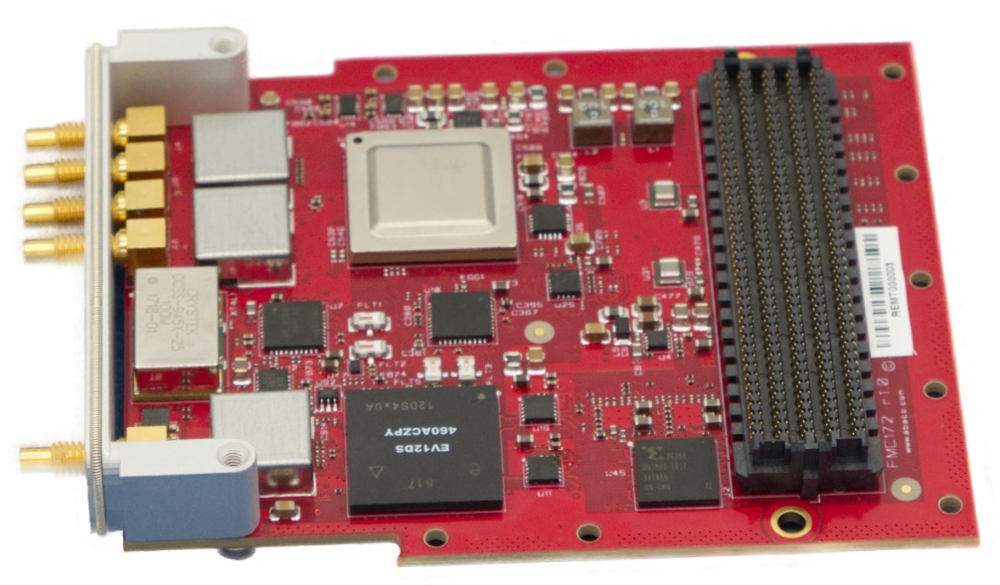
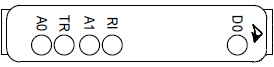
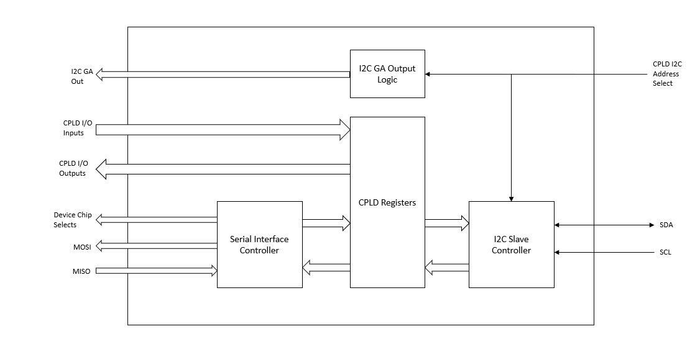

# User Manual

FMC172 Digital-to-Analog Daughter Card

THE FM172 IS DESIGNED TO MEET THE EUROPEAN UNION \(EU\) RESTRICTIONS OF HAZARDOUS SUBSTANCE \(ROHS\) DIRECTIVE \(2015/863\) CURRENT REVISION.

Publication No. UM088 Rev. 1.0

Document History

| Revision | Date | Changes | Author | Peer Review | Quality Approval |
| :--- | :--- | :--- | :--- | :--- | :--- |
| r1.0 | 2019/10/03 | Initial Release | CNS | RTM/ANe | Pko |

Waste Electrical and Electronic Equipment \(WEEE\) Returns

<table>
  <thead>
    <tr>
      <th style="text-align:left">
        
      </th>
      <th style="text-align:left">
        
Abaco Systems is registered with an approved Producer Compliance Scheme
          (PCS) and, subject to suitable contractual arrangements being in place,
          will ensure WEEE is processed in accordance with the requirements of the
          WEEE Directive.

        
Abaco Systems will evaluate requests to take back products purchased by
          our customers before August 13, 2005 on a case by case basis. A WEEE management
          fee may apply.

      </th>
    </tr>
  </thead>
  <tbody></tbody>
</table>About This Manual

Conventions

Notices

This manual may use the following types of notice:

 warning

Warnings alert you to the risk of severe personal injury.

 caution

Cautions alert you to system danger or loss of data.

 Note

Notes call attention to important features or instructions.

 tip

Tips give guidance on procedures that may be tackled in a number of ways.

 link

Links take you to other documents or websites.

Numbers

All numbers are expressed in decimal, except addresses and memory or register data, which are expressed in hexadecimal. Where confusion may occur, decimal numbers have a “D” subscript and binary numbers have a “b” subscript. The prefix “0x” shows a hexadecimal number, following the ‘C’ programming language convention. Thus:

 One dozen = 12D = 0x0C = 1100b

The multipliers “k”, “M” and “G” have their conventional scientific and engineering meanings of x103, x106 and x109, respectively, and can be used to define a transfer rate. The only exception to this is in the description of the size of memory areas, when “K”, “M” and “G” mean x210, x220 and x230 respectively.

In PowerPC terminology, multiple bit fields are numbered from 0 to n where 0 is the MSB and n is the LSB. PCI terminology follows the more familiar convention that bit 0 is the LSB and n is the MSB.

Text

Signal names ending with “\#” denote active low signals; all other signals are active high. “N” and “P” denote the low and high components of a differential signal respectively.

Further Information

Abaco Website

You can find information regarding Abaco products on the following website:

 link

[https://www.abaco.com/products](https://www.abaco.com/products)

Third-party Documents

ANSI/VITA 57.1-2010, FPGA Mezzanine Card \(FMC\) Standard

 link

[https://www.vita.com](https://www.vita.com/)

Datasheet ADC12DL3200, 12bit 5.4GSPS Analog to Digital Converter

Datasheet LMX2594, RF Synthesizer with Integrated VCO

 link

[https://www.ti.com](https://www.ti.com/)

Datasheet AD7291, 8 - Channel I2C 12Bit SAR ADC with Temp Sensor

 link

[https://www.analog.com](https://www.analog.com/)

Datasheet EV12DS460A Low Power 12-bit Digital to Analog Converter with 4/2:1 Multiplexer

 link

[https://www.teledyne-e2v.com](https://www.teledyne-e2v.com/)

 Note

Technical literature describing components used on the FMC172 is available from the manufacturers’ websites.

Technical Support Contact Information

You can find technical assistance contact details on the website Support page.

 link

[https://www.abaco.com/support](https://www.abaco.com/support)

Abaco will log your query in the Technical Support database and allocate it a unique Case number for use in any future correspondence.

Alternatively, you may also contact Abaco’s Technical Support via:

 link

[support@abaco.com](mailto:support@abaco.com)

Returns

If you need to return a product, there is a Return Materials Authorization \(RMA\) form available via the website Support page.

 link

[https://www.abaco.com/support](https://www.abaco.com/support)

Do not return products without first contacting the Abaco Repairs facility.

EMC

This module is designed to operate from within an enclosed host system, which is built to provide EMC shielding. Operation within the EU EMC guidelines is not guaranteed unless it is installed within an adequate host system. This module is protected from damage by fast voltage transients originating from outside the host system which may be introduced through the system.

Safety

This module presents no hazard to the user.

Contents

[About This Manual 3]()

[1 • General Description 10]()

[2 • Installation 12]()

[2.1 Installation and Handling Instructions 12]()

[2.2 LVDS Requirements 12]()

[2.3 Cabling 12]()

[3 • Design 13]()

[3.1 Physical Specifications 13]()

[3.1.1 Board Dimensions 13]()

[3.1.2 Front Panel Connectors 14]()

[3.2 Main Characteristics 15]()

[3.3 Electrical Specifications 16]()

[3.3.1 EEPROM 16]()

[3.3.2 FMC Mezzanine Connector 17]()

[3.3.3 ADC Data Pair Mapping 17]()

[3.3.4 DAC Data Pair Mapping 17]()

[3.3.5 JTAG Chain 18]()

[4 • Analog Inputs 19]()

[4.1.1 AC Coupling 19]()

[4.1.2 Full Scale Adjustment 19]()

[4.1.3 Typical Frequency Response 19]()

[4.1.4 ADC Low Frequency Response 20]()

[5 • Analog Output 21]()

[5.1 DAC Power Out 21]()

[5.2 Analog Output Configuration 21]()

[6 • Clocking 22]()

[6.1 PLL 100 MHz Reference Oscillator 22]()

[6.2 PLL External Reference 22]()

[6.3 Internal Sample Clock 23]()

[6.3.1 LMX2594 Clock Ranges 23]()

[6.3.2 LMX2594 Noise Considerations with Internal Reference 23]()

[6.3.3 LMX2594 Noise Considerations with External Reference 23]()

[6.3.4 SYSREF Generation 23]()

[6.3.5 SYSREF Spur Considerations on the LMX2594 24]()

[6.3.6 ADC LMX2594 PLL Loop Filter Design 24]()

[6.3.7 Impact of PFD Frequency on Phase Noise and Loop Bandwidth 24]()

[6.3.8 DAC LMX2594 PLL Loop Filter Design 25]()

[6.3.9 Impact of PFD on Phase Noise and Loop Bandwidth on DAC PLL 25]()

[6.4 External Trigger/Synchronization Input 26]()

[6.4.1 50-Ω LVPECL Sync /Trigger Signal Path Input 26]()

[6.5 ADC – DAC Phase Detector 27]()

[6.6 DAC – FPGA Synchronization 27]()

[6.6.1 Analog Calibration Path 28]()

[6.7 Multiple Card Synchronization 28]()

[6.7.1 Synchronization Procedure 30]()

[6.8 Power Supply 31]()

[7 • Controlling the FMC172 32]()

[7.1 I2C Devices 32]()

[7.1.1 I2C Address Translation for Second AD7291 33]()

[7.2 Controlling the CPLD 34]()

[7.2.1 CPLD Simplified Block Diagram 34]()

[7.2.2 CPLD Register Map 35]()

[7.2.3 CPLD Signals Functional Description 36]()

[7.3 Controlling the Clock Tree 39]()

[7.3.1 Oscillators and Switches 39]()

[7.4 Guidelines for Controlling Onboard Voltage and Temp Monitoring 39]()

[7.4.1 AD7291 \(ADC Monitor\) 40]()

[7.4.2 ADC Temperature Measurement 40]()

[7.4.3 DAC Temperature Measurement 41]()

[7.4.4 AD7291 \(Voltage Monitor\) 42]()

[8 • Specifications 43]()

[8.1 Environmental Specifications 43]()

[8.2 Cooling 43]()

[8.2.1 Convection Cooling 43]()

[8.2.2 Conduction Cooling 44]()

[A • FMC172 FMC Mezzanine and Carrier Connector Pinout Tables 45]()

[Glossary 54]()

List of Figures

[Figure 1-1 FMC172 Block Diagram 11]()

[Figure 3-1 FMC172 Dimensions 13]()

[Figure 3-2 Bezel 14]()

[Figure 3-3 JTAG Connection 18]()

[Figure 4-1 Normalized ADC Frequency Response 19]()

[Figure 4-2 ADC Low Frequency Response 20]()

[Figure 5-1 DAC Output Power 21]()

[Figure 6-1 FMC172 Clocking Scheme 22]()

[Figure 6-2 Trigger / Synchronization Signal Path 26]()

[Figure 6-3 DAC Calibration Path 28]()

[Figure 6-4 Synchronizing Multiple Cards 29]()

[Figure 6-5 System Clocking 30]()

[Figure 7-1 CPLD Architecture 34]()

[Figure 8-1 Temperature, Velocity and Pressure Trade-offs 44]()

List of Tables

[Table 3-1 FMC172 Daughter Card Main Characteristics 15]()

[Table 3-2 HPC Signal Utilization 17]()

[Table 6-1 Effect of PFD Frequency on LMX Loop Filter Parameters 24]()

[Table 6-2 Effect of PFD Frequency on LMX Loop Filter Parameters 25]()

[Table 6-3 Sync / Trigger Control Bits 27]()

[Table 6-4 FMC Available Power and Power Consumption 31]()

[Table 7-1 I2C Slave Addresses 32]()

[Table 7-2 AD7291 \#2 Address Translation 33]()

[Table 7-3 CPLD Register Map 35]()

[Table 7-4 CPLD Control Signals 36]()

[Table 7-5 Supported Clock Modes 39]()

[Table 7-6 AD7291 Voltage Parameters 40]()

[Table 7-7 AD7291 Temperature and Voltage Parameters 42]()

[Table A-1 Control Signal Mapping 45]()

[Table A-2 Clock Signal Usage 46]()

[Table A-3 Reserved GPT Lanes 46]()

[Table A-4 LVDS LA Bank LVDS Pair Mapping 48]()

[Table A-5 LVDS HA Bank LVDS Pair Mapping 50]()

[Table A-6 LVDS HB Bank LVDS Pair Mapping 52]()

## General Description

The FMC172 is a single channel 6.4GSPS ADC and 6.0GSPS DAC FMC daughter card. The sample clock is supplied by an internal clock source \(optionally locked to an external reference\). A trigger input for external synchronization and customized sampling control is available.

The FMC172 daughter card is mechanically and electrically compliant to FMC standard \(ANSI/VITA 57.1\). The card has a high-pin count connector, front panel I/O, and can be used in a conduction cooled environment.

The design is based on TI’s 12-bit ADC12DL3200 ADC and E2V’s 12-bit EV12DS460AZP DAC. Due to FMC pin limitations, only 10 bits are used on both converters. The analog input and output signals are available on the front panel on coax connections. The ADC and DAC have individual calibration circuits for fine-tuning of gain, offset, and phase.

The FMC172 allows flexible control on sampling frequency, and calibration through serial I2C communication. Furthermore, the card is equipped with power supply and temperature monitoring via I2C. A high-level block diagram of the FMC172 is shown in Figure 1-1.

Figure 1-1 FMC172 Block Diagram

## Installation

Installation and Handling Instructions

Prevent electrostatic discharges by observing ESD precautions when handling the card.

Do not flex the card and do not exceed 2.0 in-lbs on the coax connectors.

The FMC172 card must be installed on a carrier card compliant to the FMC standard.

The FMC172 card can support VADJ/VIO\_B voltage range of 1.65V to 3.3V.

The FMC172 is designed to be operated in continuously cooled environment, operation without sufficient cooling for any length of time may damage the device and void the warranty.

LVDS Requirements

The FMC172 features parallel DDR LVDS inputs and outputs. The DAC has four 10-bit buses running at a maximum of 1.5 Gbit/s. The ADC has four 10-bit buses running at a maximum of 1.6 Gbit/s. The ADC can output a training pattern on the LVDS outputs to enable phase alignment on the carrier card. The ADC and DAC also both provide a DDR clock synchronous with the data words.

Cabling

Quality coax cables are critical to achieving optimal performance. Mating cables can be ordered online from typical vendors such as Fairview Microwave and Pasternack. Shown below are three examples of a typical 12” long SSMC plug to SMA-male cable.

This is in no way an endorsement of a particular vendor, simply a list of cables that we have used in house in the past.

Fairview Microwave \# FMCA1508-12 \(FM-SR086TBJ Coax\)

Fairview Microwave \# FMC0234315-12 \(RG316 Coax\)

Pasternack \# PE3C4422-12 \(LMR-100 Coax\)

Pasternack \# PE3C4444-12 \(SR405 Coax\)

For DAC to ADC Loopback a SSMC plug to SSMC plug cable would be used. An example of this is the Pasternack \# PE3C4441-6

.

## Design

Physical Specifications

Board Dimensions

The FMC172 card complies with the FMC standard known as VITA 57.1. The card is a single width conduction cooled mezzanine module \(with region 1 and front panel I/O\). The front Bezel contains five coaxial I/O signals. The stacking height is 10mm and the maximum component height on the bottom layer is 1.3mm. The general outline of the board is shown below in Figure 3-1.

Figure 3-1 FMC172 Dimensions

Front Panel Connectors

The front panel of the FMC172 contains five connectors as shown below, the hole spacing is designed to optimize signal routing path between the analog input/output connectors, the balun, and the ADC input and DAC output. By default, the board is populated with five SSMC connectors.

Figure 3-2 Bezel

The text on the bezel is expanded as follows:

**TR** Trigger Input

**A0** ADC Input 0

**A1** ADC Input 1

**RI** Reference Input

**D0** DAC Output

Main Characteristics

Table 3-1 FMC172 Daughter Card Main Characteristics

<table>
  <thead>
    <tr>
      <th style="text-align:left">FMC172 Main Characteristics</th>
      <th style="text-align:left"></th>
    </tr>
  </thead>
  <tbody>
    <tr>
      <td style="text-align:left">Analog Inputs (A0, A1)</td>
      <td style="text-align:left"></td>
    </tr>
    <tr>
      <td style="text-align:left"><b>Number of channels</b>
      </td>
      <td style="text-align:left">2</td>
    </tr>
    <tr>
      <td style="text-align:left"><b>Channel resolution</b>
      </td>
      <td style="text-align:left">10 bits</td>
    </tr>
    <tr>
      <td style="text-align:left"><b>Input voltage range normal</b>
      </td>
      <td style="text-align:left">
        
ADC FS max 2.83 Vp-p +13 dBm @ 500 MHz (max)

        
ADC FS min 1.42 Vp-p +7 dBm @ 500 MHz (min)

      </td>
    </tr>
    <tr>
      <td style="text-align:left"><b>Input impedance</b>
      </td>
      <td style="text-align:left">50 &#x3A9; Single ended</td>
    </tr>
    <tr>
      <td style="text-align:left"><b>Analog input bandwidth</b>
      </td>
      <td style="text-align:left">
        
3 dB BW: 2 MHz to 8000 MHz typical

        
Amplitudes referenced to a 100 MHz input signal at 0 dBm

      </td>
    </tr>
    <tr>
      <td style="text-align:left"><b>SFDR</b>
      </td>
      <td style="text-align:left">
        
Ain = -1 dBFS, foreground calibration

        
Fin = 347 MHz, -55 dBFS Typ.

        
Fin = 997 MHz, -55 dBFS Typ.

        
Fin = 2482 MHz, -52 dBFS Typ.

        
Fin = 4997 MHz, -49 dBFS Typ.

        
Fin = 6397 MHz, -47 dBFS Typ.

        
Fin = 8197 MHz, -46 dBFS Typ.

      </td>
    </tr>
    <tr>
      <td style="text-align:left"><b>Sampling frequency range</b>
      </td>
      <td style="text-align:left">
        
1.6 to 6400 GSPS Single channel mode

        
800 to 3200 MSPS Dual channel mode

      </td>
    </tr>
    <tr>
      <td style="text-align:left"><b>Data width</b>
      </td>
      <td style="text-align:left">4 x 10 LVDS lanes at 1.6 Gbit/s max</td>
    </tr>
    <tr>
      <td style="text-align:left"><b>Data format</b>
      </td>
      <td style="text-align:left">Offset binary (default) or 2&#x2019;s complement</td>
    </tr>
    <tr>
      <td style="text-align:left">Analog Output (DO)</td>
      <td style="text-align:left"></td>
    </tr>
    <tr>
      <td style="text-align:left"><b>Number of channels</b>
      </td>
      <td style="text-align:left">1</td>
    </tr>
    <tr>
      <td style="text-align:left"><b>Channel resolution</b>
      </td>
      <td style="text-align:left">10 bits</td>
    </tr>
    <tr>
      <td style="text-align:left"><b>Output voltage range</b>
      </td>
      <td style="text-align:left">0.45 Vp-p / -3.0 dBm into 50 &#x2126; at 500 MHz typ. in NRZ mode</td>
    </tr>
    <tr>
      <td style="text-align:left"><b>Output impedance</b>
      </td>
      <td style="text-align:left">50 &#x3A9; Single ended</td>
    </tr>
    <tr>
      <td style="text-align:left"><b>Analog output bandwidth</b>
      </td>
      <td style="text-align:left">DAC 3dB BW: 2 MHz to 7.5 GHz in addition to sinc roll-off</td>
    </tr>
    <tr>
      <td style="text-align:left"><b>SFDR</b>
      </td>
      <td style="text-align:left">
        
Typical values at 0 dBFS output in NRZ mode:

        
101 MHz: 67dB

        
1551 MHz: 57dB

        
2951 MHz: 50dB

      </td>
    </tr>
    <tr>
      <td style="text-align:left"><b>Sampling frequency range</b>
      </td>
      <td style="text-align:left">~100 to 6000 MHz using onboard PLL</td>
    </tr>
    <tr>
      <td style="text-align:left"><b>Data width</b>
      </td>
      <td style="text-align:left">4 x 10 LVDS lanes at 1.5 Gbit/s max</td>
    </tr>
    <tr>
      <td style="text-align:left"><b>Data Format</b>
      </td>
      <td style="text-align:left">Offset binary</td>
    </tr>
    <tr>
      <td style="text-align:left">External Reference Input (RI)</td>
      <td style="text-align:left"></td>
    </tr>
    <tr>
      <td style="text-align:left"><b>Frequency range</b>
      </td>
      <td style="text-align:left">5 to 100 MHz</td>
    </tr>
    <tr>
      <td style="text-align:left"><b>Input amplitude</b>
      </td>
      <td style="text-align:left">
        
-3 to +10 dBm/ ~0.45 to 2.0 Vp-p AC coupled into 50 &#x3A9;

        
Recommended input: +10 dBm / 2.0 Vp-p @ 100 MHz

        
Phase noise improves with increasing input level

        
Max +11 dBm @ 100 MHz

        
Nominal PFD is 100 MHz

      </td>
    </tr>
    <tr>
      <td style="text-align:left">External Trigger / Timestamp Input (TI)</td>
      <td style="text-align:left"></td>
    </tr>
    <tr>
      <td style="text-align:left"><b>Trigger input signal</b>
      </td>
      <td style="text-align:left">LVPECL compatible input, 1.8V threshold voltage, DC coupled into 50 &#x3A9;</td>
    </tr>
    <tr>
      <td style="text-align:left"><b>Input impedance</b>
      </td>
      <td style="text-align:left">50 &#x3A9;</td>
    </tr>
    <tr>
      <td style="text-align:left"><b>Trigger frequency range</b>
      </td>
      <td style="text-align:left">Up to 2 GHz using single ended 50-&#x2126; LVPECL levels</td>
    </tr>
    <tr>
      <td style="text-align:left">Latency</td>
      <td style="text-align:left"></td>
    </tr>
    <tr>
      <td style="text-align:left"><b>ADC input to DAC output</b>
      </td>
      <td style="text-align:left">
        
17.2 ns typ.

        
Signal is inputted to the ADC, looped back through a PC820 carrier board
          and outputted through the DAC.

        
Result includes delay through PC820 carrier.

      </td>
    </tr>
  </tbody>
</table>Electrical Specifications

The ADC uses 40 \(4x10\) LVDS lanes operating at a maximum rate of 1.6 GSPS. The DAC uses 40 \(4x10\) LVDS lanes operating at a maximum rate of 1.5 GSPS.

All control signals are via the I2C bus through the CPLD acting as an I2C to SPI bridge.

A VADJ range of 1.65V to 3.3V is supported. The voltage on the VIO\_B pins will follow the voltage on VADJ. All CLK pins are LVDS per the FMC standard.

EEPROM

The FMC172 card carries a 2 Kbit EEPROM \(M24C02-RMC6TG\) which is accessible from the carrier card through the I2C bus. The EEPROM is powered by 3P3VAUX. The standby current is only 0.01µA when SCL and SDA are kept at 3P3VAUX level. Onboard pull-up resistors allow these signals to be left floating. The EEPROM is write-protected. The EEPROM directly faces the I2C bus, all other devices are on the isolated side of an PCA9517A I2C bus repeater.

FMC Mezzanine Connector

The recommendations from AV57.1 Table 14 have been considered.

The ADC DACLK is mapped to CLK0\_M2C

The DAC DSP Clock Output signal is mapped to CLK1\_M2C

CLK2\_M2C not used, can be left floating

The trigger signal to the FPGA logic is mapped to CLK3\_BIDR

Table 3-2 HPC Signal Utilization

| \# LVDS Clock Pairs | \# LVDS Data Pairs | \# Clock Pairs | \#GBT Data Pairs M2C | \#GBT Data Pairs C2M |
| :--- | :--- | :--- | :--- | :--- |
| CLK0\_M2C – ADC DDACLK output |  | 1 |  |  |
| CLK1\_M2C – DAC DSP CLK output |  | 1 |  |  |
| CLK3\_BIDR – Trigger to FPGA |  | 1 |  |  |
| ADC Data Pairs | 40 |  |  |  |
| DAC Data Pairs | 40 |  |  |  |

ADC Data Pair Mapping

The ADC is used in its default 12-bit mode, but only the upper 10 bits of the ADC’s 12-bit data bus, D11 through D2 are mapped to the LVDS lanes on the respective half of the connector.

DAC Data Pair Mapping

The upper 10 bits of the DAC’s 12-bit data bus, D11 through D2 are mapped to the LVDS lanes on the respective half of the connector.

JTAG Chain

In a stacked environment, the TDI pin will be decoupled from the TDO pin by the PRST\_M2C\# signal coming from the bottom connector. TRST\#, TCK, TMS, TDI and TDO are directly connected between top to bottom connector on the FMC172.

Figure 3-3 JTAG Connection

## Analog Inputs

AC Coupling

The FMC172 uses transformer / balun coupling for single-ended to differential conversion. The analog input is AC-coupled at the connector to limit DC biasing of the transformer.

Full Scale Adjustment

Input full-scale voltage adjustment is available by adjusting the FS\_RANGE\_A and FS\_RANGE\_B registers in the ADCs. The default value is 0xA000 which provides a nominal full scale of +11dBm. A value of 0xFFF is used in Fmc172APP reference software, which results in a higher SNR and decreased SFDR. Refer to section 7.3.1.2 \(Full-Scale Voltage Adjustment\) of the TI ADC12DL3200 datasheet for details.

Typical Frequency Response

Below is a plot of the typical ADC response of each channel in interleaved mode. The 3dB roll-off is around 8 GHz.

Figure 4-1 Normalized ADC Frequency Response

ADC Low Frequency Response

The typical Low frequency response of ADC is shown below. The -3dB point is around 2 MHz.

Figure 4-2 ADC Low Frequency Response

## Analog Output

DAC Power Out

Below is a plot of the typical DAC output power across frequency at 6 GSPS for the four output modes.

Figure 5-1 DAC Output Power

Analog Output Configuration

There are two RF switches and a calibration filter between the input connector and the output connector. This is used for adjusting the timing of the data lines to the DAC. See [Section 6.6, “DAC – FPGA Synchronization”](). The switches are controlled by CPLD signals CAL\_ENABLE\_3P3 and CAL\_DISABLE\_3P3. For normal operation, the CAL\_ENABLE\_3P3 signal is set to a 0, and the CAL\_DISABLE\_3P3 signal is set to a 1.

## Clocking

The FMC172 ADC and DAC can be locked to either an onboard 100 MHz oscillator or an external reference source. Onboard reference signals are length matched to aide in synchronization.

A block diagram of the clocking scheme is shown below.

Figure 6-1 FMC172 Clocking Scheme

The sample clocks for the ADC and DAC are generated by their own TI LMX2594 PLL synthesizer. This allows the ADC and DAC to operate at different clock rates.

PLL 100 MHz Reference Oscillator

The FMC172 uses an ultra-low phase noise sinewave oscillator as its reference. When not used, this oscillator should be powered down by clearing the OSC\_100\_ENABLE bit in the CPLD to prevent any potential interference.

PLL External Reference

Per the TI datasheet, optimal performance of the LMX2594 PLL occurs with a PFD frequency of 200 MHz, the FMC172 external reference input will function with any frequency between 10 MHz and 100 MHz, operation below 10 MHz is possible with some degradation.

When using the external reference, the onboard 100 MHz oscillator should be powered down by clearing the CPLD bit OSC\_100\_ENABLE, and the external reference should be selected by setting the CPLD bit EXT\_REF\_ENABLE.

Internal Sample Clock

The FMC172 uses a Texas Instruments LMX2594 High Performance, Wideband N / Frac-N PLL Synthesizer with Integrated VCO to generate the sample clock. The CPLD bit ADC\_LMX2594\_EN and DAC\_LMX2594\_EN must be set to enable operation.

Frequency Ranges:  
DAC: 300 to 6000 MHz  
ADC: 800 to 3200 MHz

LMX2594 Clock Ranges

The upper frequency of the LMX2594 that supplies the DAC is limited by the DAC’s maximum clock frequency of 6000 MHz. The upper frequency of the LMX2594 that supplies the ADC is limited by the ADC’s maximum clock frequency of 3200 MHz. The lower frequency for the DAC is limited by the coupling capacitors to the DAC. \(about 300 MHz\) The lower frequency for the ADC is the ADCs minimum clock frequency of 800 MHz.

LMX2594 Noise Considerations with Internal Reference

For the FMC172, the best noise performance will occur when directly using the  
100 MHz as the phase detector reference signal with the PLL in Integer-N mode. Lower PFDs will tend to be nosier and have the greatest impact on higher frequency input signals.

LMX2594 Noise Considerations with External Reference

The external reference input on the FMC172 goes to the LMX2594’s reference input. This input has a bandwidth of 100 MHz and any additional noise on the external reference will translate to noise on the ADC and DAC signals. The use of a bandpass or low-pass filter on the external reference is strongly recommended. Optimum performance occurs with a PFD frequency of 100 MHz and when the reference frequency is an integer multiple of the PFD frequency. Any phase noise on the external reference signal will be multiplied up by 20log\(Fout/Fref\)

SYSREF Generation

A SYSREF signal is used to synchronize multiple DACs and ADCs. In order to meet setup and hold times for the ADC, a SYSREF calibration is performed as part of the synchronization process. For a detailed description of this calibration, see the ADC datasheet. The SYSREF signals for the ADC and DAC are each generated by their own LMX2594. The ADC LMX2594 sends continuous pulses to the ADC during the ADC’s SYSREF calibration. It is then turned off once the ADC calibration is completed. The DAC LMX2594 simply sends a burst of pulses for synchronization.

The SYSREF pulses may be triggered internally by the CPLD or externally from the TR port. To trigger SYSREF internally, set the signal EXT\_LMX\_SYNC\_SEL\_3P3 to a 1 and CPLD\_SYSREFREQ\_EN\_3P3 to a 1. Then set CPLD\_SYNC\_TRIG\_3P3 to a 1 to generate the trigger by setting to a 1, then back to a 0.

To trigger SYSREF externally, the CPLD sets the signal EXT\_LMX\_SEL\_3P3 to a 0 and CPLD\_SYSREFREQ\_EN\_3P3 to a 1. Then send the send the trigger pulse to TR connector \(see Table 6-3\).

SYSREF Spur Considerations on the LMX2594

After the SYSREF calibration is complete and the SYSREF pulses have been sent, It is recommended to set the SYSREF divider to its maximum value. This is to minimize spurs from the SYSREF divider coupling into the sample clock line. This is recommended even if the LMX2594 output has been disabled.

ADC LMX2594 PLL Loop Filter Design

The loop filter for PLL1 is optimized for a PFD frequency of 100 MHz and a loop filter bandwidth of 379 kHz with a phase margin of 50°.

This gives an estimated jitter of ~58 fs in a 1 kHz to 20 MHz bandwidth, and a ~60 fs of jitter in a 1 Hz to 6400 MHz bandwidth

Using the clock doubler can drop the jitter to ~56 fs but won’t allow use of the sync function.

Impact of PFD Frequency on Phase Noise and Loop Bandwidth

The table below shows the effect of changing PFD Frequency by either using the doubler or the reference divider.

Table 6-1 Effect of PFD Frequency on LMX Loop Filter Parameters

| PFD Frequency \(MHz\) | Bandwidth \(kHz\) | Phase Margin \(Deg.\) | Phase Noise \(fs\) |
| :--- | :--- | :--- | :--- |
| 100 | 379 | 51 | 60 |
| 50 | 216 | 65 | 73 |
| 10 | 47 | 82 | 193 |
| 1 | 5.1 | 68 | 1191 |

As would be expected, this shows that PLL performance is only optimized for a single PFD frequency and the effect of the reference noise being multiplied up by 20log\(N\).

DAC LMX2594 PLL Loop Filter Design

The default loop filter for PLL1 is optimized for a PFD frequency of 100 MHz and a loop filter bandwidth of 260 kHz and a phase margin of 56°.

This gives an estimated jitter of ~55 fs in a 1 kHz to 20 MHz bandwidth, and a ~56 fs of jitter in a 1 Hz to 6000 MHz bandwidth

Using the clock doubler can drop the jitter to ~51 fs but won’t allow use of the sync function.

Impact of PFD on Phase Noise and Loop Bandwidth on DAC PLL

The table below shows the effect of changing PFD frequency by either using the doubler or the reference divider.

Table 6-2 Effect of PFD Frequency on LMX Loop Filter Parameters

| PFD Frequency \(MHz\) | Bandwidth \(kHz\) | Phase Margin \(Deg.\) | Phase Noise \(fs\) |
| :--- | :--- | :--- | :--- |
| 100 | 260 | 56 | 55 |
| 50 | 144 | 69 | 69 |
| 10 | 30 | 82 | 191 |
| 1 | 3.5 | 60 | 1145 |

As would be expected, this shows that PLL performance is only optimized for a single PFD frequency and the effect of the reference noise being multiplied up by 20log\(N\).

External Trigger/Synchronization Input

The FMC172 has an external single ended 50-Ω LVPECL trigger input which is converted to LVDS and can be distributed to the ADC, LMX PLLs, and FPGA, either individually or in combination by configuring the control signals listed in Table 6-3.

50-Ω LVPECL Sync /Trigger Signal Path Input

The trigger circuit uses two 2x2 cross point switches to route a SYNC / trigger signal from two possible sources \(external and CPLD\) to three possible destinations \(FPGA trigger input, LMX PLLs, and ADC Timestamp\). The external trigger input is biased at ~1.8V to support an LVPECL input. The LMX PLLs and the FPGA can mask off the line when not being used. The SysRefReq and Sync signals to the LMX PLLs are clocked in on the same reference clock used for the PLLs. The simplified block diagram below shows the trigger paths.

Figure 6-2 Trigger / Synchronization Signal Path

The Sync / Trigger source is selected by four bits in the CPLD as outlined in the table below.

Table 6-3 Sync / Trigger Control Bits

| Trigger / Sync Source Selection Multiplexer Settings |  |  |  |  |  |  |  |
| :--- | :--- | :--- | :--- | :--- | :--- | :--- | :--- |
| Function | External Trigger Input | CPLD\_SYNC\_TRIG\_3P3 | EXT\_LMX\_SYNC\_SEL\_3P3 | EXT\_ADC\_SYNC\_SEL\_3P3 | ADC\_STROBE\_3P3 | CPLD\_SYSREFREQ\_EN\_3P3 | LMX\_SYNC\_3P3 |
| Passive EXT Trigger | 0 | 0 | 1 | 1 | X | x | 0 |
| Passive CPLD | 0 | 0 | 0 | 0 | X | x | 0 |
| CPLD Syncs LMX Reference | 0 | 2 Pulses | 1 | 0 | X | 0 | 1 then 0 |
| CPLD triggers SYSREF | 0 | Pulse | 1 | 0 | X | 1 | 0 |
| CPLD Triggers FPGA | 0 | Pulse | 1 | 0 | 0 | 0 | 0 |
| CPLD Timestamp ADC | 0 | Pulse | 0 | 1 | X | 0 | 0 |
| EXT Trigger Syncs LMX | 2 Pulses | 0 | 0 | 1 | X | 0 | 1 then 0 |
| EXT Trigger SYSREF | Pulse | 0 | 0 | 1 | X | 1 | 0 |
| EXT Triggers FPGA | Pulse | 0 | 0 | 1 | 0 | 0 | 0 |
| EXT Timestamp ADC | Pulse | 0 | 1 | 0 | X | 0 | 0 |
| ADC Strobe triggers FPGA | X | X | X | X | 1 | 0 | 0 |

ADC – DAC Phase Detector

The FMC172 has phase detector that outputs from 1.24V to 2.30V. This may be used to verify that the phase between the ADC and DAC clock outputs are deterministic.

DAC – FPGA Synchronization

The DAC provides the DSP clock to the FPGA for the FPGA to clock the digital data at the DAC sample rate. However, due to the propagation delay to the FPGA and back to the DAC, the data will be delayed some amount that may violate system level timing requirements between the FPGA and DAC. The DAC is able to delay the DSP clock in relation to the sample clock \(and by relation the clock/4 that clocks the data in\) in 8 half sample clock increments. Please refer to the EV12DS460 datasheet for details. Additionally, the FPGA may have the ability to delay the data presented to the DAC in order to meet system level timing requirements.

Analog Calibration Path

The analog calibration path can be used to examine the output of the DAC. If the data is clocked in incorrectly, the DAC output can be examined by the ADC to help determine the cause. Figure 6-3 shows the DAC calibration path. To enable calibration, the CAL\_ENABLE\_3P3 signal is set to a 1, and the CAL\_DISABLE\_3P3 signal line is set to a 0. This sends the DAC output into the ADC input through a bandpass filter allowing the system to be calibrated.

Figure 6-3 DAC Calibration Path

Multiple Card Synchronization

For systems that use multi-board synchronization, care must be taken in the choice of sample clock frequencies. The LMX2594 has a minimum N divide value of 28. When the sync is enabled, an additional divide by 4 or divide by 6 is added inside the loop, making the divide by N smaller. This limits the max PFD frequency that can be used with synchronization enabled. This can be compensated by reducing the phase detector frequency at the expense of phase jitter performance. TI’s design tool PLLatinum Sim can be used for estimating phase noise on the clocks.

For synchronization to work across multiple cards, the cards need to be supplied with phase-matched reference signals. In addition, external synchronization pulses are required. Match the cable length between the clock/sync generator and each FMC172. With a 6GHz sample clock, a reference signal mismatch of 83ps will introduce an error in the synchronization of ½ of the sample clock. With LMR-100 cables, 83ps corresponds to approximately 16mm.

The clock generator needs to be able to tune the phase relationship between the clock and sync pulses to satisfy the setup/hold timing requirements. The sync pulse must occur no later than 2ns prior to the next rising edge of the reference clock. It is important that the clock can cleanly drive the 50-Ω cables used to connect to the FMC172 boards.

Close attention should be paid to the trigger signal and the trigger input impedance and best performance will be achieved when the trigger source, interconnect cable, and trigger input impedance are all 50Ω. Anything with a slower rise time than LVPECL will probably not work very well.

The reference clock should be as spectrally clean as possible. Any noise on the reference will degrade the performance of the FMC172. This is especially evident close in, at high input frequencies. The basic concept of clock and trigger distribution for multiple card synchronization is shown below.

Figure 6-4 Synchronizing Multiple Cards

Synchronization Procedure

Once the reference clocks and triggers are provided to the FMC172, the following are steps to synchronize the boards. Refer to Figure 6-5 for the following steps.

Program the PLL in SYNC mode.

Configure the FMC172s to accept and external sync pulse.

Set CPLD bit lmx\_sync\_edge high.

Send an external pulse to the FMC on the TR input. This pulse will assert the SYNC on the LMX2594 to synchronize the FMC172s’ PLLs.

Set CPLD bit lmx\_sync\_edge low.

Send an external pulse to the FMC172s. This will de-assert the SYNC on the LMX2594.

Use the FMC172 software to configure the FMC172s to accept an external SYSREF start pulse.

Send an external pulse to the FMC172s. This pulse will cause the FMC172s’ LMX2594s to generate SYSREF pulses. The DAC LMX2594 is set to send two SYSREF pulses when triggered. The ADC LMX2594 is set to send a continuous stream of pulses and is turned off when ADC SYSREF calibration is complete. At this point, the ADC and DAC are synchronized.

Use the FMC172 software to configure the FMC172s to route triggers to the FPGAs and configure the FPGAs to reset internal clock dividers based on the trigger events.

Use the FMC172 software to configure the FPGAs to accept external triggers for data acquisition and data generation.

Send an external pulse to the FMC172s. This pulse will cause the FPGAs to acquire ADC data and send DAC data.

Figure 6-5 System Clocking

Power Supply

The available input power, through the HPC connector, along with typical and maximum current consumption is shown below.

Table 6-4 FMC Available Power and Power Consumption

<table>
  <thead>
    <tr>
      <th style="text-align:left">Power Plane</th>
      <th style="text-align:left">Maximum Available</th>
      <th style="text-align:left">Typical Current (mA)</th>
      <th style="text-align:left">Maximum Current (mA)</th>
      <th style="text-align:left">Typical Power (W)</th>
      <th style="text-align:left">Maximum Power (W)</th>
    </tr>
  </thead>
  <tbody>
    <tr>
      <td style="text-align:left">VADJ</td>
      <td style="text-align:left">4000 mA</td>
      <td style="text-align:left">20</td>
      <td style="text-align:left">-</td>
      <td style="text-align:left">-</td>
      <td style="text-align:left">-</td>
    </tr>
    <tr>
      <td style="text-align:left">3P3V</td>
      <td style="text-align:left">3000 mA</td>
      <td style="text-align:left">1818</td>
      <td style="text-align:left">2009</td>
      <td style="text-align:left">6.029</td>
      <td style="text-align:left">6.63</td>
    </tr>
    <tr>
      <td style="text-align:left">12P0V</td>
      <td style="text-align:left">1000 mA</td>
      <td style="text-align:left">632</td>
      <td style="text-align:left">741</td>
      <td style="text-align:left">7.824</td>
      <td style="text-align:left">9.108</td>
    </tr>
    <tr>
      <td style="text-align:left">VIOB</td>
      <td style="text-align:left">1mA</td>
      <td style="text-align:left"></td>
      <td style="text-align:left"></td>
      <td style="text-align:left"></td>
      <td style="text-align:left"></td>
    </tr>
    <tr>
      <td style="text-align:left">
        
3P3VAUX
           (Operating)

        
3P3VAUX
           (Standby)

      </td>
      <td style="text-align:left">
        
20 mA

        
1 &#xB5;A

      </td>
      <td style="text-align:left">1.8 mA</td>
      <td style="text-align:left">5.8 mA</td>
      <td style="text-align:left">5.9 mW</td>
      <td style="text-align:left">19 mW</td>
    </tr>
  </tbody>
</table>## Controlling the FMC172

I2C Devices

The devices shown in the table below are directly connected to the I2C bus, The EEPROM is powered by VAUX and directly faces the I2C bus, the other devices including the I2C for a stacked FMC are behind an I2C level translator for isolation until full power is applied.

Table 7-1 I2C Slave Addresses

<table>
  <thead>
    <tr>
      <th style="text-align:left">Device</th>
      <th style="text-align:left">I2C Address</th>
      <th style="text-align:left">GA1</th>
      <th style="text-align:left">GA0</th>
      <th style="text-align:left">Address Binary</th>
      <th style="text-align:left">Address Hex</th>
    </tr>
  </thead>
  <tbody>
    <tr>
      <td style="text-align:left">M24C02 (EEPROM)</td>
      <td style="text-align:left">10100XX</td>
      <td style="text-align:left">
        
0

        
0

        
1

        
1

      </td>
      <td style="text-align:left">
        
0

        
1

        
0

        
1

      </td>
      <td style="text-align:left">
        
1010000

        
1010010

        
1010001

        
1010011

      </td>
      <td style="text-align:left">
        
0x50

        
0x52

        
0x51

        
0x53

      </td>
    </tr>
    <tr>
      <td style="text-align:left">
        
AD7291

        
(ADC Monitor)

      </td>
      <td style="text-align:left">010XXXX</td>
      <td style="text-align:left">
        
0

        
0

        
1

        
1

      </td>
      <td style="text-align:left">
        
0

        
1

        
0

        
1

      </td>
      <td style="text-align:left">
        
0101111

        
0101100

        
0100011

        
0100000

      </td>
      <td style="text-align:left">
        
0x2F

        
0x2C

        
0x23

        
0x20

      </td>
    </tr>
    <tr>
      <td style="text-align:left">
        
AD7291

        
(Voltage Monitor)

      </td>
      <td style="text-align:left">010XXXX</td>
      <td style="text-align:left">
        
0

        
0

        
1

        
1

      </td>
      <td style="text-align:left">
        
0

        
1

        
0

        
1

      </td>
      <td style="text-align:left">See Table 7-2</td>
      <td style="text-align:left">
        
(Translated)

        
0x2E

        
0x2B

        
0x28

        
0x22

      </td>
    </tr>
    <tr>
      <td style="text-align:left">
        
CPLD

        
(Board Control)

      </td>
      <td style="text-align:left">00111XX</td>
      <td style="text-align:left">
        
0

        
0

        
1

        
1

      </td>
      <td style="text-align:left">
        
0

        
1

        
0

        
1

      </td>
      <td style="text-align:left">
        
0011100

        
0011101

        
0011110

        
0011111

      </td>
      <td style="text-align:left">
        
0x1C

        
0x1D

        
0x1E

        
0x1F

      </td>
    </tr>
  </tbody>
</table> NoteS

* The CPLD reads the GA0 and GA1 lines, and provides 2 buffered output signals CPLD\_GA0\_OUT\_3P3 and CPLD\_GA1\_OUT\_3P3
* To allow operation of a stacked card, the CPLD reads the GA0 and GA1 lines and provides 2 buffered output signals CPLD\_GA0\_OUT\_CC\_3P3 and CPLD\_GA1\_OUT\_CC\_3P3, by default the CPLD should read the numeric value of the GA0 and GA1 and increment this by 1 \(firmware permitting\) if not, an address can be hardcoded based on the carrier card used.
* To allow a second AD7291 to exist on the FMC172 address re-mapping is used as described in [Section 7.1.1]().  

I2C Address Translation for Second AD7291

To monitor all the supply voltages as well as the ADC’s temperature a second AD7291 is located on the FMC172 with an alternate set of addresses provided by the CPLD. The CPLD drives the XGA0 and XGA1 pins based on the lookup table shown in the table below.

Table 7-2 AD7291 \#2 Address Translation

| FMC Signal | CPLD Output | Final Address |  |  |  |
| :--- | :--- | :--- | :--- | :--- | :--- |
| GA1 | GA0 | XGA1/AS1 | XGA0/AS0 | Binary | Hex |
| 0 | 0 | 0 | Tri-State | 010 1110 | 0x2E |
| 0 | 1 | Tri-State | 1 | 010 1011 | 0x2B |
| 1 | 0 | Tri-State | 0 | 010 1010 | 0x28 |
| 1 | 1 | 1 | Tri-State | 010 0010 | 0x22 |

Controlling the CPLD

The CPLD is implemented as an I2C device with registers that are used to control devices, read status bits, and perform I2C to SPI transactions.

Good knowledge of the internal structure and communication protocol of relevant onboard devices is required for controlling the FMC172. For detailed information, it is recommended to refer to the datasheets mentioned in the related documents section of this document. In addition, Abaco may be contacted for support.

CPLD Simplified Block Diagram

A Xilinx XC2C256 CPLD is used to implement the control logic between the host I2C bus and the FMC172. See Table 7-4 for a full list of signals connected to the CPLD. Refer to the simplified block diagram of the CPLD below.

Figure 7-1 CPLD Architecture

CPLD Register Map

Table 7-3 CPLD Register Map

<table>
  <thead>
    <tr>
      <th style="text-align:left">Register</th>
      <th style="text-align:left">Address</th>
      <th style="text-align:left">R/W</th>
      <th style="text-align:left">Description</th>
    </tr>
  </thead>
  <tbody>
    <tr>
      <td style="text-align:left">ADDR_COMMAND</td>
      <td style="text-align:left">0x00</td>
      <td style="text-align:left">W</td>
      <td style="text-align:left">
        
Selects which device to communicate with.

        
<b>BIT 0</b>: adc_dval, default = 0

        
<b>BIT 1</b>: dac_dval, default = 0

        
<b>BIT 2</b>: adc_lmx_dval, default = 0

        
<b>BIT 3</b>: dac_lmx_dval, default = 0

        
<b>BIT 4-7: Reserved</b>
        

      </td>
    </tr>
    <tr>
      <td style="text-align:left">ADDR_CONTROL0</td>
      <td style="text-align:left">0x01</td>
      <td style="text-align:left">R/W</td>
      <td style="text-align:left">
        
<b>BIT 0</b>: osc_100_en, default = 1

        
<b>BIT 1</b>: ext_ref_en, default = 0

        
<b>BIT 2</b>: adc_lmx_en, default = 0

        
<b>BIT 3</b>: dac_lmx_en, default = 0

        
<b>BIT 4</b>: ext_lmx_sync_sel, default = 1

        
<b>BIT 5</b>: ext_adc_sync_sel, default = 0

        
<b>BIT 6</b>: cal_disable, default = 1

        
<b>BIT 7</b>: cal_en, default = 0

      </td>
    </tr>
    <tr>
      <td style="text-align:left">ADDR_CONTROL1</td>
      <td style="text-align:left">0x02</td>
      <td style="text-align:left">R/W</td>
      <td style="text-align:left">
        
<b>BIT 0</b>: sync_cpld, default = 0

        
<b>BIT 1</b>: lmx_sync_edge, default = 0

        
<b>BIT 2</b>: adc_strobe_sel, default = 0

        
<b>BIT 3</b>: adc_syncse, default = 0

        
<b>BIT 4</b>: ad7291_reset, default = 1

        
<b>BIT 5</b>: reserved

        
<b>BIT 6</b>: cpld_led, default = 1

        
<b>BIT 7</b>: RESERVED, must write 1

      </td>
    </tr>
    <tr>
      <td style="text-align:left">ADDR_CONTROL2</td>
      <td style="text-align:left">0x03</td>
      <td style="text-align:left">R/W</td>
      <td style="text-align:left">
        
<b>BIT 0</b>: adc_pd, default = 0

        
<b>BIT 1</b>: adc_caltrig, default = 0

        
<b>BIT 2</b>: cpld_sysrefreq_en, default = 1

        
<b>BIT 3</b>: dac_spi_reset, default = 1

        
<b>BIT 4</b>: dac_phase_sel&lt;0&gt;, default = 0

        
<b>BIT 5</b>: dac_phase_sel&lt;1&gt;, default = 0

        
<b>BIT 6</b>: dac_phase_sel&lt;2&gt;, default = 0

        
<b>BIT 7</b>: dac_clk_div_sel, default = 0

      </td>
    </tr>
    <tr>
      <td style="text-align:left">ADDR_STATUS0</td>
      <td style="text-align:left">0x04</td>
      <td style="text-align:left">R</td>
      <td style="text-align:left">
        
<b>BIT 0</b>: tvf

        
<b>BIT 1</b>: adc_calstat

        
<b>BIT 2</b>: alarm_ad7291&lt;0&gt; Temperature ALARM

        
<b>BIT 3</b>: alarm_ad7291&lt;1&gt; Voltage ALARM

        
<b>BIT 4</b>: RESERVED

        
<b>BIT 5</b>: ps_pg

        
<b>BIT 6</b>: ga0_mod_in

        
<b>BIT 7</b>: ga1_mod_in

      </td>
    </tr>
    <tr>
      <td style="text-align:left">ADDR_VERSION</td>
      <td style="text-align:left">0x05</td>
      <td style="text-align:left">R</td>
      <td style="text-align:left">0x10</td>
    </tr>
    <tr>
      <td style="text-align:left">ADDR_I2C _DATA_0</td>
      <td style="text-align:left">0x06</td>
      <td style="text-align:left">W</td>
      <td style="text-align:left">LSB byte to send to the selected SPI device</td>
    </tr>
    <tr>
      <td style="text-align:left">ADDR_I2C _DATA_1</td>
      <td style="text-align:left">0x07</td>
      <td style="text-align:left">W</td>
      <td style="text-align:left">2nd byte to send to the selected SPI device</td>
    </tr>
    <tr>
      <td style="text-align:left">ADDR_I2C _DATA_2</td>
      <td style="text-align:left">0x08</td>
      <td style="text-align:left">W</td>
      <td style="text-align:left">3rd byte to send to the selected SPI device</td>
    </tr>
    <tr>
      <td style="text-align:left">ADDR_I2C _READ_0</td>
      <td style="text-align:left">0x0E</td>
      <td style="text-align:left">R</td>
      <td style="text-align:left">LSB byte read from SPI device</td>
    </tr>
    <tr>
      <td style="text-align:left">ADDR_I2C _READ_1</td>
      <td style="text-align:left">0x0F</td>
      <td style="text-align:left">R</td>
      <td style="text-align:left">MSB byte read from SPI device</td>
    </tr>
  </tbody>
</table>CPLD Signals Functional Description

All banks of CPLD will be referenced to 3.3V \(RED\) or 1.8V \(GREEN\). I/O’s will be level shifted as required. The signal direction is as follows:

Output signals from the CPLD are identified with an ‘O’

Input Signals to the CPLD are identified with an ‘I’

Bidirectional Signals are identified with an ‘I/O’

The address \(ADR header\) is formatted as x.x \(Address.Bit\)

The signal names and functions are listed below.

Table 7-4 CPLD Control Signals

<table>
  <thead>
    <tr>
      <th style="text-align:left">
        
Signal Name

        
(Schematic Net Name)

      </th>
      <th style="text-align:left">
        
Initial

        
State

      </th>
      <th style="text-align:left">I/O</th>
      <th style="text-align:left">ADR</th>
      <th style="text-align:left"></th>
    </tr>
  </thead>
  <tbody>
    <tr>
      <td style="text-align:left">adc_dval (ADC1_SPI_SCS_3P3#)</td>
      <td style="text-align:left">1</td>
      <td style="text-align:left">O</td>
      <td style="text-align:left">0.0</td>
      <td style="text-align:left">Chip select output for ADC0 SPI</td>
    </tr>
    <tr>
      <td style="text-align:left">
        
dac_dval

        
(DAC_SPI_CS_3.3#)

      </td>
      <td style="text-align:left">1</td>
      <td style="text-align:left">O</td>
      <td style="text-align:left">0.1</td>
      <td style="text-align:left">Chip select output for DAC0 SPI</td>
    </tr>
    <tr>
      <td style="text-align:left">adc_lmx_dval (ALMX2594_SPI_CS_3P3#)</td>
      <td style="text-align:left">1</td>
      <td style="text-align:left">O</td>
      <td style="text-align:left">0.2</td>
      <td style="text-align:left">Chips select output for ADC LMX2594 SPI</td>
    </tr>
    <tr>
      <td style="text-align:left">dac_lmx_dval (DLMX2594_SPI_CS_3P3#)</td>
      <td style="text-align:left">1</td>
      <td style="text-align:left">O</td>
      <td style="text-align:left">0.3</td>
      <td style="text-align:left">Chips select output for DAC LMX2594 SPI</td>
    </tr>
    <tr>
      <td style="text-align:left"></td>
      <td style="text-align:left"></td>
      <td style="text-align:left"></td>
      <td style="text-align:left"></td>
      <td style="text-align:left"></td>
    </tr>
    <tr>
      <td style="text-align:left">
        
osc_100_en

        
(OSC_100_ENABLE_3P3)

      </td>
      <td style="text-align:left">1</td>
      <td style="text-align:left">O</td>
      <td style="text-align:left">1.0</td>
      <td style="text-align:left">A logic 1 enables the power supply to the onboard 100 MHz reference oscillator</td>
    </tr>
    <tr>
      <td style="text-align:left">
        
ext_ref_en

        
(EXT_REF_ENABLE_3P3)

      </td>
      <td style="text-align:left">0</td>
      <td style="text-align:left">O</td>
      <td style="text-align:left">1.1</td>
      <td style="text-align:left">A logic 0 routes the 100 MHz reference oscillator to the LMX PLL clock
        input</td>
    </tr>
    <tr>
      <td style="text-align:left">adc_lmx_en (ADC_LMX2594LMX_EN)</td>
      <td style="text-align:left">0</td>
      <td style="text-align:left">O</td>
      <td style="text-align:left">1.2</td>
      <td style="text-align:left">A logic 1 enables the LMX2594 PLL synthesizer via CE pin</td>
    </tr>
    <tr>
      <td style="text-align:left">
        
dac_lmx_en

        
(DAC_LMX2594LMX_EN_3P3)

      </td>
      <td style="text-align:left">0</td>
      <td style="text-align:left">O</td>
      <td style="text-align:left">1.3</td>
      <td style="text-align:left">A logic 1 enables the LMX2594 PLL synthesizer via CE pin</td>
    </tr>
    <tr>
      <td style="text-align:left">
        
ext_lmx_sync_sel

        
(EXT_LMX_SYNC_SEL_3P3)

      </td>
      <td style="text-align:left">1</td>
      <td style="text-align:left">O</td>
      <td style="text-align:left">1.4</td>
      <td style="text-align:left">A logic 0 selects external input for the SYSREFReq</td>
    </tr>
    <tr>
      <td style="text-align:left">
        
ext_adc_sync_sel

        
(EXT_ADC_SYNC_SEL_3P3)

      </td>
      <td style="text-align:left">0</td>
      <td style="text-align:left">O</td>
      <td style="text-align:left">1.5</td>
      <td style="text-align:left">A logic 0 transmits the FPGA synchronization pattern on data lines</td>
    </tr>
    <tr>
      <td style="text-align:left">
        
cal_disable

        
(CAL_DISABLE_3P3)

      </td>
      <td style="text-align:left">1</td>
      <td style="text-align:left">O</td>
      <td style="text-align:left">1.6</td>
      <td style="text-align:left">A logic 1 disables the analog loopback</td>
    </tr>
    <tr>
      <td style="text-align:left">
        
cal_enable

        
(CAL_ENABLE_3P3)

      </td>
      <td style="text-align:left">0</td>
      <td style="text-align:left">O</td>
      <td style="text-align:left">1.7</td>
      <td style="text-align:left">A logic 0 disables the analog loopback</td>
    </tr>
    <tr>
      <td style="text-align:left"></td>
      <td style="text-align:left"></td>
      <td style="text-align:left"></td>
      <td style="text-align:left"></td>
      <td style="text-align:left"></td>
    </tr>
    <tr>
      <td style="text-align:left">
        
sync_cpld

        
(CPLD_SYNC_TRIG_3P3)

      </td>
      <td style="text-align:left">0</td>
      <td style="text-align:left">O</td>
      <td style="text-align:left">2.0</td>
      <td style="text-align:left">Trigger from CPLD</td>
    </tr>
    <tr>
      <td style="text-align:left">lmx_sync_edge
         (LMX_SYNC_3P3)</td>
      <td style="text-align:left">0</td>
      <td style="text-align:left">O</td>
      <td style="text-align:left">2.1</td>
      <td style="text-align:left">Sync pulse to sync LMX PLLs to sync to the rising edge of the reference
        input.</td>
    </tr>
    <tr>
      <td style="text-align:left">
        
adc_strobe_sel

        
(ADC_STROBE_3P3)

      </td>
      <td style="text-align:left">0</td>
      <td style="text-align:left">O</td>
      <td style="text-align:left">2.2</td>
      <td style="text-align:left">A logic 1 Selects adc strobe output to FPGA</td>
    </tr>
    <tr>
      <td style="text-align:left">
        
adc_syncse

        
(ADC_SYNCESE#_3P3)

      </td>
      <td style="text-align:left">0</td>
      <td style="text-align:left">O</td>
      <td style="text-align:left">2.3</td>
      <td style="text-align:left">A logic 1 sets to output digital interfaces test patterns from ADC</td>
    </tr>
    <tr>
      <td style="text-align:left">
        
ad7291_reset-

        
(AD7291_RESET_3P3#)

      </td>
      <td style="text-align:left">1</td>
      <td style="text-align:left">O</td>
      <td style="text-align:left">2.4</td>
      <td style="text-align:left">A logic 0 resets both AD7291 Devices 10k external pull up to vcc, this
        line must default to a 1, do not hold this line at a logic 0</td>
    </tr>
    <tr>
      <td style="text-align:left">Reserved</td>
      <td style="text-align:left">x</td>
      <td style="text-align:left">x</td>
      <td style="text-align:left">2.5</td>
      <td style="text-align:left"></td>
    </tr>
    <tr>
      <td style="text-align:left">
        
cpld_led

        
(LED_ENABLE_3P3)

      </td>
      <td style="text-align:left">1</td>
      <td style="text-align:left">O</td>
      <td style="text-align:left">2.6</td>
      <td style="text-align:left">Software controllable LED 1 = ON</td>
    </tr>
    <tr>
      <td style="text-align:left">Reserved</td>
      <td style="text-align:left">1</td>
      <td style="text-align:left">O</td>
      <td style="text-align:left">2.7</td>
      <td style="text-align:left">Always set to 1</td>
    </tr>
    <tr>
      <td style="text-align:left"></td>
      <td style="text-align:left"></td>
      <td style="text-align:left"></td>
      <td style="text-align:left"></td>
      <td style="text-align:left"></td>
    </tr>
    <tr>
      <td style="text-align:left">
        
adc_pd

        
(ADC_PD_3P3)

      </td>
      <td style="text-align:left">0</td>
      <td style="text-align:left">O</td>
      <td style="text-align:left">3.0</td>
      <td style="text-align:left">A logic 1 causes the ADC to enter low power mode.</td>
    </tr>
    <tr>
      <td style="text-align:left">
        
adc_caltrig

        
(ADC_CALTRIG_3P3)

      </td>
      <td style="text-align:left">0</td>
      <td style="text-align:left">O</td>
      <td style="text-align:left">3.1</td>
      <td style="text-align:left">A logic 1 triggers ADC foreground calibration.</td>
    </tr>
    <tr>
      <td style="text-align:left">cpld_sysrefreq_en (CPLD_SYSREFREQ_EN_3P3)</td>
      <td style="text-align:left">1</td>
      <td style="text-align:left">O</td>
      <td style="text-align:left">3.2</td>
      <td style="text-align:left">A logic 1 enables SYSREFReq pulse</td>
    </tr>
    <tr>
      <td style="text-align:left">
        
dac_spi_reset

        
(DAC_SPI_RESET_3P3#)

      </td>
      <td style="text-align:left">1</td>
      <td style="text-align:left">O</td>
      <td style="text-align:left">3.3</td>
      <td style="text-align:left">A logic 0 resets the DAC</td>
    </tr>
    <tr>
      <td style="text-align:left">
        
dac_phase_sel&lt;0&gt;

        
(DAC_PHASE_SEL0_3P3)

      </td>
      <td style="text-align:left">0</td>
      <td style="text-align:left">O</td>
      <td style="text-align:left">3.4</td>
      <td style="text-align:left">
        
DAC_PHASE_SEL&lt;0&gt;

        
(DAC_PHASE_SEL0_3P3)

      </td>
    </tr>
    <tr>
      <td style="text-align:left">
        
dac_phase_sel&lt;1&gt;

        
(DAC_PHASE_SEL1_3P3)

      </td>
      <td style="text-align:left">0</td>
      <td style="text-align:left">O</td>
      <td style="text-align:left">3.5</td>
      <td style="text-align:left">
        
DAC_PHASE_SEL&lt;1&gt;

        
(DAC_PHASE_SEL1_3P3)

      </td>
    </tr>
    <tr>
      <td style="text-align:left">
        
dac_phase_sel&lt;2&gt;

        
(DAC_PHASE_SEL2_3P3)

      </td>
      <td style="text-align:left">0</td>
      <td style="text-align:left">O</td>
      <td style="text-align:left">3.6</td>
      <td style="text-align:left">
        
DAC_PHASE_SEL&lt;0&gt;

        
(DAC_PHASE_SEL0_3P3)

      </td>
    </tr>
    <tr>
      <td style="text-align:left">
        
dac_clk_div_sel

        
(DAC_CLK_DIV_SEL_3P3)

      </td>
      <td style="text-align:left">0</td>
      <td style="text-align:left">O</td>
      <td style="text-align:left">3.7</td>
      <td style="text-align:left">
        
Logic 0 selects OCDS0

        
Logic 1 select OCDS2

      </td>
    </tr>
    <tr>
      <td style="text-align:left"></td>
      <td style="text-align:left"></td>
      <td style="text-align:left"></td>
      <td style="text-align:left"></td>
      <td style="text-align:left"></td>
    </tr>
    <tr>
      <td style="text-align:left">
        
tvf

        
(TVF_3P3)

      </td>
      <td style="text-align:left">x</td>
      <td style="text-align:left">I</td>
      <td style="text-align:left">4.0</td>
      <td style="text-align:left">DAC timing violation flag</td>
    </tr>
    <tr>
      <td style="text-align:left">
        
adc_calstat

        
(ADC_CALSTAT_3P3)

      </td>
      <td style="text-align:left">x</td>
      <td style="text-align:left">I</td>
      <td style="text-align:left">4.1</td>
      <td style="text-align:left">ADC alarm output (1.8V)</td>
    </tr>
    <tr>
      <td style="text-align:left">
        
alarm_ad7291&lt;0&gt;

        
(ALARM_AD7291_0_3P3)

      </td>
      <td style="text-align:left">x</td>
      <td style="text-align:left">I</td>
      <td style="text-align:left">4.2</td>
      <td style="text-align:left">AD7291 Alarm output mostly temp and Voltage</td>
    </tr>
    <tr>
      <td style="text-align:left">
        
alarm_ad7291&lt;1&gt;

        
(ALARM_AD7291_1_3P3)

      </td>
      <td style="text-align:left">x</td>
      <td style="text-align:left">I</td>
      <td style="text-align:left">4.3</td>
      <td style="text-align:left">AD7291 Alarm output mostly voltages</td>
    </tr>
    <tr>
      <td style="text-align:left">RESERVED</td>
      <td style="text-align:left">x</td>
      <td style="text-align:left">I</td>
      <td style="text-align:left">4.4</td>
      <td style="text-align:left"></td>
    </tr>
    <tr>
      <td style="text-align:left">
        
ps_pg

        
(PS_PG)

      </td>
      <td style="text-align:left">x</td>
      <td style="text-align:left">I</td>
      <td style="text-align:left">4.5</td>
      <td style="text-align:left">Power supply power good.</td>
    </tr>
    <tr>
      <td style="text-align:left">
        
ga0_mod_in

        
(GA0_MOD_IN_3P3)

      </td>
      <td style="text-align:left">x</td>
      <td style="text-align:left">I</td>
      <td style="text-align:left">4.6</td>
      <td style="text-align:left">Input state of GA0</td>
    </tr>
    <tr>
      <td style="text-align:left">
        
ga1_mod_in

        
(GA1_MOD_IN_3P3)

      </td>
      <td style="text-align:left">x</td>
      <td style="text-align:left">I</td>
      <td style="text-align:left">4.7</td>
      <td style="text-align:left">Input state of GA1</td>
    </tr>
    <tr>
      <td style="text-align:left"></td>
      <td style="text-align:left"></td>
      <td style="text-align:left"></td>
      <td style="text-align:left"></td>
      <td style="text-align:left"></td>
    </tr>
    <tr>
      <td style="text-align:left">
        
SPI_SCLK

        
(SPI_SCLK_3P3)

      </td>
      <td style="text-align:left">0</td>
      <td style="text-align:left">O</td>
      <td style="text-align:left"></td>
      <td style="text-align:left">3.3V SPI serial clock to LMXs, ADC, DAC</td>
    </tr>
    <tr>
      <td style="text-align:left">
        
SPI_MOSI

        
(SPI_MOSI_3P3)

      </td>
      <td style="text-align:left">0</td>
      <td style="text-align:left">O</td>
      <td style="text-align:left"></td>
      <td style="text-align:left">3.3V SPI data to LMXs, ADC, DAC</td>
    </tr>
    <tr>
      <td style="text-align:left">
        
SPI_LMX_MISO

        
(SPI_DLMX_MISO_3P3)

      </td>
      <td style="text-align:left">x</td>
      <td style="text-align:left">I</td>
      <td style="text-align:left"></td>
      <td style="text-align:left">3.3V DAC LMX SPI data output</td>
    </tr>
    <tr>
      <td style="text-align:left">
        
SPI_ADC_MISO

        
(ADC_SPI_MISO_3P3)

      </td>
      <td style="text-align:left">x</td>
      <td style="text-align:left">I</td>
      <td style="text-align:left"></td>
      <td style="text-align:left">3.3V ADC SPI data output</td>
    </tr>
    <tr>
      <td style="text-align:left">
        
I2C_SCL

        
(ISO_I2C_SCL_3P3)

      </td>
      <td style="text-align:left">x</td>
      <td style="text-align:left">I</td>
      <td style="text-align:left"></td>
      <td style="text-align:left">I2C clock input to CPLD, on isolated side of PCA9517</td>
    </tr>
    <tr>
      <td style="text-align:left">
        
I2C_SDA

        
(ISO_I2C_SDA_3P3)

      </td>
      <td style="text-align:left">x</td>
      <td style="text-align:left">I/O</td>
      <td style="text-align:left"></td>
      <td style="text-align:left">I2C data i/o CPLD, on isolated side of PCA9517</td>
    </tr>
    <tr>
      <td style="text-align:left">
        
CPLD_XGA0_OUT

        
(CPLD_XGA0_OUT_3P3)

      </td>
      <td style="text-align:left">x</td>
      <td style="text-align:left">O</td>
      <td style="text-align:left"></td>
      <td style="text-align:left">Alternate address controls for AD7291 (LUT output from GA0:GA1)</td>
    </tr>
    <tr>
      <td style="text-align:left">
        
CPLD_XGA1_OUT

        
(CPLD_XGA1_OUT_3P3)

      </td>
      <td style="text-align:left">x</td>
      <td style="text-align:left">O</td>
      <td style="text-align:left"></td>
      <td style="text-align:left">(LUT output from GA0:GA1)</td>
    </tr>
    <tr>
      <td style="text-align:left">
        
GA0_CC_OUT

        
(GA0_CC_OUT_3P3)

      </td>
      <td style="text-align:left">x</td>
      <td style="text-align:left">O</td>
      <td style="text-align:left"></td>
      <td style="text-align:left">GA0&#x2026;GA1_CC = (GA0&#x2026;GA1) +1</td>
    </tr>
    <tr>
      <td style="text-align:left">
        
GA1_CC_OUT

        
(GA1_CC_OUT_3P3)

      </td>
      <td style="text-align:left">x</td>
      <td style="text-align:left">O</td>
      <td style="text-align:left"></td>
      <td style="text-align:left">(Read input and increment by 1)</td>
    </tr>
    <tr>
      <td style="text-align:left">
        
CPLD_GA0_OUT

        
(CPLD_GA0_OUT_3P3)

      </td>
      <td style="text-align:left">x</td>
      <td style="text-align:left">O</td>
      <td style="text-align:left"></td>
      <td style="text-align:left">Tracks GA0, provides isolated buffered signal</td>
    </tr>
    <tr>
      <td style="text-align:left">
        
CPLD_GA1_OUT

        
(CPLD_GA1_OUT_3P3)

      </td>
      <td style="text-align:left">x</td>
      <td style="text-align:left">O</td>
      <td style="text-align:left"></td>
      <td style="text-align:left">Tracks GA1, provides isolated buffered signal</td>
    </tr>
    <tr>
      <td style="text-align:left">
        
CLK4

        
(CPLD_4M_CLK_3P3_4)

      </td>
      <td style="text-align:left">x</td>
      <td style="text-align:left">I</td>
      <td style="text-align:left"></td>
      <td style="text-align:left">4 MHz clock input to CPLD</td>
    </tr>
    <tr>
      <td style="text-align:left">
        
STACKED_PG_M2C

        
(STACKED_CARD_PG_M2C)

      </td>
      <td style="text-align:left">x</td>
      <td style="text-align:left">I</td>
      <td style="text-align:left"></td>
      <td style="text-align:left">Connection only CPLD vision to stacked card present</td>
    </tr>
  </tbody>
</table>Controlling the Clock Tree

Oscillators and Switches

The FMC172 has an RF switch that selects whether an internal or external reference is used. These switches must be configured via I2C register writes to the CPLD for various configurations. The following table lists the CPLD bits that are required to be modified for a specific mode of operation.

Table 7-5 Supported Clock Modes

<table>
  <thead>
    <tr>
      <th style="text-align:left">Function</th>
      <th style="text-align:left">osc_100_en</th>
      <th style="text-align:left">adc_lmx2594_en</th>
      <th style="text-align:left">dac_lmx2594_en</th>
      <th style="text-align:left">ext_ref_en</th>
    </tr>
  </thead>
  <tbody>
    <tr>
      <td style="text-align:left">Power down</td>
      <td style="text-align:left">0</td>
      <td style="text-align:left">0</td>
      <td style="text-align:left">0</td>
      <td style="text-align:left">0</td>
    </tr>
    <tr>
      <td style="text-align:left">
        
LMX PLL

        
with Internal reference

      </td>
      <td style="text-align:left">1</td>
      <td style="text-align:left">1</td>
      <td style="text-align:left">1</td>
      <td style="text-align:left">0</td>
    </tr>
    <tr>
      <td style="text-align:left">
        
LMX PLL

        
with External reference

      </td>
      <td style="text-align:left">0</td>
      <td style="text-align:left">1</td>
      <td style="text-align:left">1</td>
      <td style="text-align:left">1</td>
    </tr>
  </tbody>
</table>Guidelines for Controlling Onboard Voltage and Temp Monitoring

The FMC172 includes 2 AD7291 ‘8-channel I2C 12-bit SAR ADCs with temperature monitor’ devices for monitoring power supply voltages as well as local and remote temperatures. The device can be programmed and read through the I2C bus at the address defined in [Section 8.1]().

1. At powerup, the application software should write a ‘1’ to the Reset bit in the Command Register to initialize the part to a known state.

All measured values must be multiplied by a constant to convert to the actual analog level. Formulas are included in the associated tables and text.

Continuously operating the I2C bus might interfere with the A/D conversion process resulting in signal distortion. It is recommended to program the minimum and maximum thresholds in the monitoring device and only read from the device when the interrupt line is asserted.

AD7291 \(ADC Monitor\)

The first device is configured to monitor the DAC voltages and temperatures shown in the table below. To convert the ADC reading to voltage or temperature multiply the ADC value by the scaling factor listed in the table. For the ADCs 2 onboard temperature monitors see [Section 7.4.2]().

Table 7-6 AD7291 Voltage Parameters

| Parameter: | Voltage | Formula |
| :--- | :--- | :--- |
| Channel 0 | VP1P1\_ADC\_ANA | ADC0 \* .00061035V |
| Channel 1 | VP1P9\_ADC\_ANA | ADC1 \* .00061035V |
| Channel 2 | VP1P9\_ADC\_LVDS | ADC2 \* .00061035V |
| Channel 3 | VP3P3\_DAC\_DIG | ADC3 \*. 0012207V |
| Channel 4 | VP\_5P0VA | ADC4 \*.00183105V |
| Channel 5 | VP5V5VA | ADC5 \* .00183105V |
| Channel 6 | ADC\_TEMP | \(ADC6\) 1.6mV / °C, see text |
| Channel 7 | DAC\_TEMP | \(ADC7\) 1.17mV / °C, see text |
| Temperature | \(internally generated\) | AD7921 ADC TEMP \* .0625 °C |

ADC Temperature Measurement

Texas Instruments specifies a maximum die temperature of 105C for the ADCDL3200 ADC IC, and notes that operation above this point will degrade the life expectancy of the ADC. The ADC die temperature requires calibration of the temperature diodes to ensure the maximum die temperature is not exceeded.

On the FMC172, the ADC has a temperature diode, \(TDIODE\) which can be used to monitor the ADC’s temperature. The FMC172 forward biases the TDIODE with a 100uA current source and the resulting temperature dependent voltages can be monitored on channel 6 of the AD7291 described above.

The temperature diode should be measured at a known ambient temperature to get an accurate offset voltage. This offset is used in a linear equation with the diode voltage slope of 1.6mV/°C

To accurately measure the diode temperature, the board should be stable at room temperature, with proper ventilation applied, the software application should then perform the following:

At powerup hold the ADC and DAC in reset. Measure the ambient temperature on the AD7291, and save this value as the ambient temperature offset as the baseline temperature in °C.

Measure the temperature diode.

Save this as the ambient temperature offset voltage.

This voltage is board and ADC specific and should be used in the individual boards end application.

Continue with normal power-up sequencing.

On subsequent temperature readings:

Measure the ADC’s internal TDIODE voltage

Subtract out the ambient temperature reference voltage

Multiply the result by .00061035V \(convert to volts\)

Divide this result by .0016 \(convert to °C\)

Add this result to the ambient temperature offset to get the die temperature in °C.

Use this result to program into the AD7291 for alarm. Once the ADC temperature is accurately calibrated, further temperature testing can proceed. If the actual ADC die temperature is at or above 105°C, you should take additional measures to further cool the board.

DAC Temperature Measurement

At powerup, hold the DAC in reset, measure the ambient temperature on the AD7291 and save this as the baseline temperature in °C.

Measure each respective temperature diode.

Save this value as the ambient temperature reference

Continue with normal power up sequencing.

On subsequent temperature readings:

Measure the DAC’s internal TDIODE voltage

Subtract out the ambient temperature reference

Multiply the result by .00061035V \(convert to volts\)

Divide this result by .00117 \(convert to °C\)

Add this result to the ambient temperature reference to get the die temperature in °C.

 Note

The hottest spot on the die is 6 °C hotter than read by the diode.

Use this result to program into the AD7291 for alarm. Once the DAC temperature is accurately calibrated, further temperature testing can proceed. If the actual DAC die temperature is at or above 105°C the user should take additional measures to further cool the board.

AD7291 \(Voltage Monitor\)

The second device, identified in paragraph 4.1 as temperature monitor, is configured to monitor the voltages that are shown in the table below. To convert the ADC reading to a voltage or temperature, multiply the ADC value by the scaling factor listed in the table.

Table 7-7 AD7291 Temperature and Voltage Parameters

| Parameter: | Voltage | Formula |
| :--- | :--- | :--- |
| Channel 0 | PHASE\_DET\_OUT | ADC0 \* .00061035V |
| Channel 1 | VP3P3\_CLOCK\_ADC | ADC1 \* .0012207V |
| Channel 2 | VP3P3\_CLOCK\_DAC | ADC2 \* .0012207V |
| Channel 3 | CPLD\_VCC\_CORE\_1P8 | ADC3 \* .00061035V |
| Channel 4 | VADJ | ADC4 \* .0012207V |
| Channel 5 | VCC\_3P3 | ADC5 \* .0012207V |
| Channel 6 | VCC\_12P0 | ADC6 \* .0036621V |
| Channel 7 | VP3P3\_DAC\_ANA | ADC7 \* .0012207V |
| Temperature | \(internally generated\) | AD7921 ADC TEMP \* 0.0625 °C |

## Specifications

Environmental Specifications

**Operating temperature**:

Dependent upon incoming airflow provided by end user as illustrated in Figure 8-1. The VITA AV47 AC2 ruggedness condition can be met by 400 LFM of mean airflow within 9 mm of the entrance to the heatsink.

**Storage temperature**:

-40 °C to +85 °C

Cooling

The FMC172 has an integral heatsink, and the board should not be operated without its heatsink. Furthermore, benchtop operation requires a fan to be used to maintain a safe operating temperature. In all cases, the temperature should be monitored and steps taken to limit the temperature rise of the board.

Two different types of cooling will be available for the FMC172.

Convection Cooling

The air flow provided by the chassis fans where the FMC172 operates, must be able to dissipate the heat generated by the onboard components. At the VITA AV47 AC2 ruggedness condition of 55 °C incoming airflow, a minimum mean airflow of 400 LFM entering the FMC172 heatsink is required. Additionally, the 400 LFM mean airflow must be met within 9 mm of the entrance to the FMC172 heatsink, otherwise acceptable thermal performance of the FMC172 cannot be guaranteed.

If the end user provides airflow which is cooler than the VITA AV57 AC2 55C ruggedness condition, then the end user may be able to achieve acceptable thermal performance with lower airflow. Conversely, if the end user provides airflow which is warmer than the VITA AV57 AC2 55C, then acceptable thermal performance could be achieved with higher airflow rates. These trade-offs and required pressure drops are illustrated in Figure 8-1.

Figure 8-1 Temperature, Velocity and Pressure Trade-offs

For standalone operations \(such as on a Xilinx development kit\), it is strongly recommended to blow air across the FMC and ensure that the temperature of the devices is within the allowed range. Additionally, if the FMC is operated without a carrier board, it is helpful to add ducting around the FMC heatsink and fan to contain the airflow to prevent boundary layer formation from negatively affecting thermal performance. Abaco’s warranty does not cover boards on which the maximum allowed temperature has been exceeded

Conduction Cooling

In demanding environments, the ambient temperature inside a chassis could be close to the operating temperature defined in this document. It is very likely that in these conditions, the junction temperature of power-consuming devices will exceed the operating conditions recommended by the devices’ manufacturers \(mostly +85 °C\). While a low-profile heatsink coupled with sufficient air flow might be sufficient to maintain the temperature within operating boundaries, some active cooling would yield better results and would certainly help with resuming operations much faster in the case the devices were disabled because of a temperature “over range”.

FMC172 FMC Mezzanine and Carrier Connector Pinout Tables

**Table Notes:**

All power and ground pins are connected to their common nets on both mezzanine and carrier connectors for stacked operation

All pins not explicitly noted in the table are passed through between the mezzanine and carrier connectors for stacked operation

Mezzanine \(module\) connector exclusive pins are noted in **RED**

Carrier connector exclusive pins are noted in **BLUE**

Common \(pass through pins\) are noted in **GREEN**

Table - Control Signal Mapping

| AV57.4 | Pin | FMC172 Signal | Notes |
| :--- | :--- | :--- | :--- |
| GA0 | **C34** | GA0\_MOD\_IN\_3.3 | Card Global Address 0 from mezzanine connector |
| GA1 | **D35** | GA1\_MOD\_IN\_3.3 | Card Global Address 1 from mezzanine connector |
| PRSNT\_M2C\# | **H2** | PRSNT\_M2C\# | Tied to GND \(FM172 is present\) |
| PG\_M2C | **F1** | PG\_M2C | Indicate FMC172 power good status to carrier |
| CLK\_DIR | **B1** | CLK\_DIR\_MODULE | Driven by mezzanine, tied low |
| FMC172 Signals Exclusive to Carrier Card |  |  |  |
| GA0 | **C34** | GA0\_CC\_OUT\_3.3 | Card Global Address 1 from CPLD to carrier connector |
| GA1 | **D35** | GA0\_CC\_OUT\_3.3 | Card Global Address 1 from CPLD to carrier connector |
| PRSNT\_M2C\# | **H2** | PRESENT\_M2C\_CC\#\_3P3 | Indicates that a stacked card is present \(from carrier connector to CPLD\) |
| PG\_M2C | **F1** | STACKED\_CARD\_PG\_M2C | Power good status from stacked card \(from carrier connector to CPLD\) |
| FMC172 Signals Used that are also Passed Through to the Carrier Connector |  |  |  |
| TSRT\# | **D34** | TRST\# | JTAG Port \(also passed through\) |
| TCK | **D29** | TCK | JTAG Port \(also passed through\) |
| TMS | **D33** | TMS | JTAG Port \(also passed through\) |
| TDI | **D30** | TDI | JTAG Port \(also passed through\) |
| TDO | **D31** | TDO | JTAG Port \(also passed through\) |
| PG\_C2M | **D1** | PG\_C2M | Carrier power is OK \(also passed through\) |
| I2C\_SCL | **C30** | I2C\_SCL | I2C Bus Clock \(also passed through\) |
| I2C\_SDA | **C31** | I2C\_SDA | I2C Bus Data \(also passed through\) |
| RES0 | **B40** | RES0 | System Reset \(also passed through\) |

The following clock signals are used by the FMC172.

Table -2 Clock Signal Usage

| AV57 Signal | FMC Connector Pin | FMC172 Signal Function |
| :--- | :--- | :--- |
| CLK0\_M2C+ | H4 | ADC\_DACLK+ |
| CLK0\_M2C- | H5 | ADC\_DACLK- |
| CLK1\_M2C+ | G2 | DAC\_DSP+ |
| CLK1\_M2C- | G3 | DAC\_DSP- |
| CLK3\_BIDR+CLK2\_BIDR+ | J2 | Trigger Output to FPGA |
| CLK3\_BIDR-CLK2\_BIDR- | J3 | Trigger Output to FPGA |

The first eight GBT lanes are reserved for the high-resolution version of the product, disabled in the default build and listed in the table below.

 Note

All of the DAC pairs are intentionally inverted to optimize the DAC RF output path.

Table -3 Reserved GPT Lanes

| AV57 Signal | FMC Connector Pin | FMC172 Signal Function |
| :--- | :--- | :--- |
| DP0\_M2C- | C7 | DAC\_D00+ |
| DP0\_M2C+ | C6 | DAC\_D00- |
| DP1\_M2C- | A3 | DAC\_D01+ |
| DP1\_M2C+ | A2 | DAC\_D01- |
| DP2\_M2C- | A7 | DAC\_C00+ |
| DP2\_M2C+ | A6 | DAC\_C00- |
| DP3\_M2C- | A11 | DAC\_A01+ |
| DP3\_M2C+ | A10 | DAC\_A01- |
|  |  |  |
| DP4\_M2C- | A15 | DAC\_B00+ |
| DP4\_M2C+ | A14 | DAC\_B00- |
| DP5\_M2C- | A19 | ADC\_A0- |
| DP5\_M2C+ | A18 | ADC\_A0+ |
| DP6\_M2C- | B17 | DAC\_A00+ |
| DP6\_M2C+ | B16 | DAC\_A00- |
| DP7\_M2C- | B13 | DAC\_B01+ |
| DP7\_M2C+ | B12 | DAC\_B01- |
|  |  |  |
| DP0\_C2M- | C3 | DAC\_C01+ |
| DP0\_C2M+ | C2 | DAC\_C01- |
| DP1\_C2M- | A23 | ADC\_B0- |
| DP1\_C2M+ | A22 | ADC\_B0+ |
| DP2\_C2M- | A27 | ADC\_B1- |
| DP2\_C2M+ | A26 | ADC\_B1+ |
| DP3\_C2M- | A31 | ADC\_A1- |
| DP3\_C2M+ | A30 | ADC\_A1+ |
|  |  |  |
| DP4\_C2M- | A35 | ADC\_C1- |
| DP4\_C2M+ | A34 | ADC\_C1+ |
| DP5\_C2M- | A39 | ADC\_D0- |
| DP5\_C2M+ | A38 | ADC\_D0+ |
| DP6\_C2M- | B37 | ADC\_C0- |
| DP6\_C2M+ | B36 | ADC\_C0+ |
| DP7\_C2M- | B33 | ADC\_D1- |
| DP7\_C2M+ | B32 | ADC\_D1+ |

All 80 LVDS pairs are mapped to the ADC and DAC. The LA bank is shown in the table below.

 Note

All of the DAC pairs are intentionally inverted to optimize the DAC RF output path.

Table -4 LVDS LA Bank LVDS Pair Mapping

| AV57 Signal | FMC Connector Pin | FMC172 Signal Function |
| :--- | :--- | :--- |
| LA00-\_CC | G7 | DAC\_C06+ |
| LA00+\_CC | G6 | DAC\_C06- |
| LA01-\_CC | D9 | DAC\_C09+ |
| LA01+\_CC | D8 | DAC\_C09- |
| LA02- | H8 | DAC\_C11+ |
| LA02+ | H7 | DAC\_C11- |
| LA03- | G10 | DAC\_B10+ |
| LA03+ | G9 | DAC\_B10- |
|  |  |  |
| LA04- | H11 | DAC\_B04+ |
| LA04+ | H10 | DAC\_B04- |
| LA05- | D12 | DAC\_B09+ |
| LA05+ | D11 | DAC\_B09- |
| LA06- | C11 | DAC\_B11+ |
| LA06+ | C10 | DAC\_B11- |
| LA07- | H14 | DAC\_D04+ |
| LA07+ | H13 | DAC\_D04- |
|  |  |  |
| LA08- | G13 | DAC\_B05+ |
| LA08+ | G12 | DAC\_B05- |
| LA09- | D15 | DAC\_D03+ |
| LA09+ | D14 | DAC\_D03- |
| LA10- | C15 | DAC\_B02+ |
| LA10+ | C14 | DAC\_B02- |
| LA11- | H17 | DAC\_D11+ |
| LA11+ | H16 | DAC\_D11- |
|  |  |  |
| LA12- | G16 | DAC\_D08+ |
| LA12+ | G15 | DAC\_D08- |
| LA13- | D18 | DAC\_A05+ |
| LA13+ | D17 | DAC\_A05- |
| LA14- | C19 | DAC\_A07+ |
| LA14+ | C18 | DAC\_A07- |
| LA15- | H20 | DAC\_A04+ |
| LA15+ | H19 | DAC\_A04- |
|  |  |  |
| LA16- | G19 | DAC\_A11+ |
| LA16+ | G18 | DAC\_A11- |
| LA17-\_CC | D21 | DAC\_A09+ |
| LA17+\_CC | D20 | DAC\_A09- |
| LA18-\_CC | C23 | ADC\_B2- |
| LA18+\_CC | C22 | ADC\_B2+ |
| LA19- | H23 | ADC\_D10- |
| LA19+ | H22 | ADC\_D10+ |
| LA20- | G22 | ADC\_B5- |
| LA20+ | G21 | ADC\_B5+ |
| LA21- | H26 | ADC\_C5- |
| LA21+ | H25 | ADC\_C5+ |
| LA22- | G25 | ADC\_C6- |
| LA22+ | G24 | ADC\_C6+ |
|  |  |  |
| LA23- | D24 | ADC\_D8- |
| LA23+ | D23 | ADC\_D8+ |
| LA24- | H29 | ADC\_C4- |
| LA24+ | H28 | ADC\_C4+ |
| LA25- | G28 | ADC\_C10- |
| LA25+ | G27 | ADC\_C10+ |
| LA26- | D27 | ADC\_B6- |
| LA26+ | D26 | ADC\_B6+ |
|  |  |  |
| LA27- | C27 | ADC\_D7- |
| LA27+ | C26 | ADC\_D7+ |
| LA28- | H32 | ADC\_C3- |
| LA28+ | H31 | ADC\_C3+ |
| LA29- | G31 | ADC\_C9- |
| LA29+ | G30 | ADC\_C9+ |
| LA30- | H35 | ADC\_C2- |
| LA30+ | H34 | ADC\_C2+ |
|  |  |  |
| LA31- | G34 | ADC\_C8- |
| LA31+ | G33 | ADC\_C8+ |
| LA32- | H38 | ADC\_D5- |
| LA32+ | H37 | ADC\_D5+ |
| LA33- | G37 | ADC\_B11- |
| LA33+ | G36 | ADC\_DB11+ |

All 80 LVDS pairs are mapped to the ADC and DAC. The HA bank is shown in the table below.

 Note

All of the DAC pairs are intentionally inverted to optimize the DAC RF output path.

Table -5 LVDS HA Bank LVDS Pair Mapping

| AV57 Signal | FMC Connector Pin | FMC172 Signal Function |
| :--- | :--- | :--- |
| HA00-\_CC | F5 | DAC\_C03+ |
| HA00+\_CC | F4 | DAC\_C03- |
| HA01-\_CC | E3 | DAC\_C02+ |
| HA01+\_CC | E2 | DAC\_C02- |
| HA02- | K8 | DAC\_C10+ |
| HA02+ | K7 | DAC\_C10- |
| HA03- | J7 | DAC\_C08+ |
| HA03+ | J6 | DAC\_C08- |
|  |  |  |
| HA04- | F8 | DAC\_C07+ |
| HA04+ | F7 | DAC\_C07- |
| HA05- | E7 | DAC\_C04+ |
| HA05+ | E6 | DAC\_C04- |
| HA06- | K11 | DAC\_B07+ |
| HA06+ | K10 | DAC\_B07- |
| HA07- | J10 | DAC\_B08+ |
| HA07+ | J9 | DAC\_B08- |
|  |  |  |
| HA08- | F11 | DAC\_B03+ |
| HA08+ | F10 | DAC\_B03- |
| HA09- | E10 | DAC\_C05+ |
| HA09+ | E9 | DAC\_C05- |
| HA10- | K14 | DAC\_D06+ |
| HA10+ | K13 | DAC\_D06- |
| HA11- | J13 | DAC\_D02+ |
| HA11+ | J12 | DAC\_D02- |
|  |  |  |
| HA12- | F14 | DAC\_D07+ |
| HA12+ | F13 | DAC\_D07- |
| HA13- | E13 | DAC\_B06+ |
| HA13+ | E12 | DAC\_B06- |
| HA14- | J16 | DAC\_D09+ |
| HA14+ | J15 | DAC\_D09- |
| HA15- | F17 | DAC\_D10+ |
| HA15+ | F16 | DAC\_D10- |
|  |  |  |
| HA16- | E16 | DAC\_D05+ |
| HA16+ | E15 | DAC\_D05- |
| HA17-\_CC | K17 | DAC\_A06+ |
| HA17+\_CC | K16 | DAC\_A06- |
| HA18- | J19 | DAC\_A02+ |
| HA18+ | J18 | DAC\_A02- |
| HA19- | F20 | DAC\_A08+ |
| HA19+ | F19 | DAC\_A08- |
|  |  |  |
| HA20- | E19 | DAC\_A03+ |
| HA20+ | E18 | DAC\_A03- |
| HA21- | K20 | DAC\_A10+ |
| HA21+ | K19 | DAC\_A10- |
| HA22- | J22 | ADC\_A11- |
| HA22+ | J21 | ADC\_A11+ |
| HA23- | K23 | ADC\_A5- |
| HA23+ | K22 | ADC\_A5+ |

Table -6 LVDS HB Bank LVDS Pair Mapping

| AV57 Signal | FMC Connector Pin | FMC172 Signal Function |
| :--- | :--- | :--- |
| HB00-\_CC | K26 | ADC\_A4- |
| HB00+\_CC | K25 | ADC\_A4+ |
| HB01- | J25 | ADC\_A10- |
| HB01+ | J24 | ADC\_A10+ |
| HB02- | F23 | ADC\_B4- |
| HB02+ | F22 | ADC\_B4+ |
| HB03- | E22 | ADC\_B3- |
| HB03+ | E21 | ADC\_B3+ |
|  |  |  |
| HB04- | F26 | ADC\_C11- |
| HB04+ | F25 | ADC\_C11+ |
| HB05- | E25 | ADC\_D9- |
| HB05+ | E24 | ADC\_D9+ |
| HB06-\_CC | K29 | ADC\_A3- |
| HB06+\_CC | K28 | ADC\_A3+ |
| HB07- | J28 | ADC\_A9- |
| HB07+ | J27 | ADC\_A9+ |
|  |  |  |
| HB08- | F29 | ADC\_D11- |
| HB08+ | F28 | ADC\_D11+ |
| HB09- | E28 | ADC\_B7- |
| HB09+ | E27 | ADC\_B7+ |
| HB10- | K32 | ADC\_A2- |
| HB10+ | K31 | ADC\_A2+ |
| HB11- | J31 | ADC\_A8- |
| HB11+ | J30 | ADC\_A8+ |
|  |  |  |
| HB12- | F32 | ADC\_B9- |
| HB12+ | F31 | ADC\_B9+ |
| HB13- | E31 | ADC\_B8- |
| HB13+ | E30 | ADC\_B8+ |
| HB14- | K35 | ADC\_D4- |
| HB14+ | K34 | ADC\_D4+ |
| HB15- | J34 | ADC\_A7- |
| HB15+ | J33 | ADC\_A7+ |
|  |  |  |
| HB16- | F35 | ADC\_B10- |
| HB16+ | F34 | ADC\_B10+ |
| HB17-\_CC | K38 | ADC\_D6- |
| HB17+\_CC | K37 | ADC\_D6+ |
| HB18- | J37 | ADC\_A6- |
| HB18+ | J36 | ADC\_A6+ |
| HB19- | E34 | ADC\_D2- |
| HB19+ | E33 | ADC\_D2+ |
|  |  |  |
| HB20- | F38 | ADC\_C7- |
| HB20+ | F37 | ADC\_C7+ |
| HB21- | E37 | ADC\_D3- |
| HB21+ | E36 | ADC\_D3+ |

Glossary

| EEPROM | Electronically Erasable Programmable Read Only Memory |
| :--- | :--- |
| FMC | FPGA Mezzanine Card |
| FPGA | Field Programmable Gate Array |
| JTAG | Joint Test Action Group |
| LDO | Low Dropout \(regulator\) |
| LED | Light Emitting Diode |
| LMX | Refers to LMX2581 |
| LSB | Least Significant Bit\(s\) |
| LVDS | Low Voltage Differential Signaling |
| LVPECL | Low Voltage Positive Emitter Coupled Logic |
| LVTTL | Low Voltage Transistor Logic Level |
| MSB | Most Significant Bit\(s\) |
| PCB | Printed Circuit Board |
| PDF | Phase Detector Frequency |
| PLL | Phase Lock Loop |

© 2019 Abaco Systems, Inc.  
All rights reserved.

\* indicates a trademark of Abaco Systems, Inc. and/or its affiliates. All other trademarks are the property of their respective owners.

This document contains Proprietary Information of Abaco Systems, Inc. and/or its suppliers or vendors. Distribution or reproduction prohibited without permission.

THIS DOCUMENT AND ITS CONTENTS ARE PROVIDED "AS IS", WITH NO REPRESENTATIONS OR WARRANTIES OF ANY KIND, WHETHER EXPRESS OR IMPLIED, INCLUDING BUT NOT LIMITED TO WARRANTIES OF DESIGN, MERCHANTABILITY, OR FITNESS FOR A PARTICULAR PURPOSE. ALL OTHER LIABILITY ARISING FROM RELIANCE ON ANY INFORMATION CONTAINED HEREIN IS EXPRESSLY DISCLAIMED.

|  |  | Publication No. UM088 Rev. 1.0 |
| :--- | :--- | :--- |

Abaco Systems

Information Centers

Americas:

 1-866-652-2226 \(866-OK-ABACO\)

 or 1-256-880-0444 \(International\)

Europe, Middle East and Africa:

 +44 \(0\)1327 359444

Additional Resources

For more information, please visit the  
Abaco Systems web site at:

[www.abaco.com](https://www.abaco.com/)

